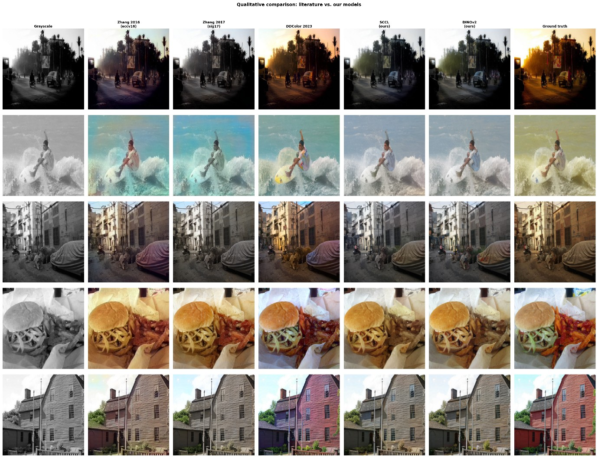
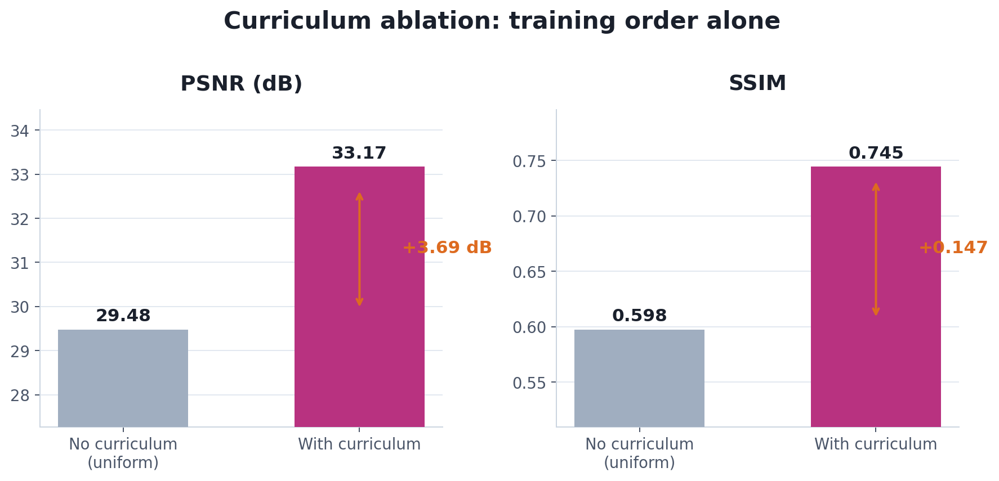
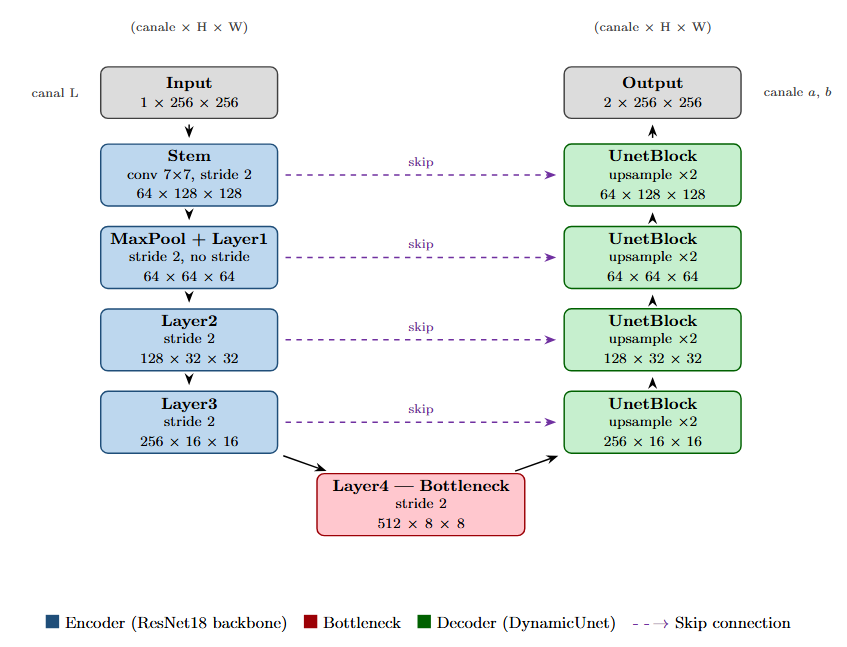
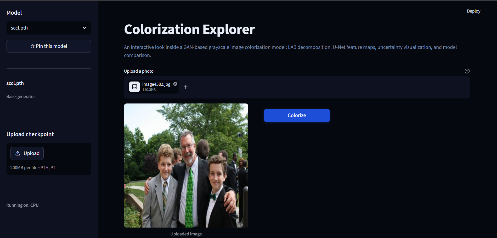

# Grayscale Image Colorization with GANs + DINOv2

Automatic colorization of grayscale photos, using a curriculum-trained GAN refined with a DINOv2 semantic cross-attention stage.

Bachelor's Thesis, Faculty of Automation, Computers and Electronics, University of Craiova, 2026.
Author: **Andra-Maria Smarandache**. Advisor: **Costin Bădică**.


---

## TL;DR

A vivid-to-uniform **colorfulness curriculum** plus **DINOv2 semantic conditioning** reaches **PSNR 27.08 dB** and **FID 9.71** on a 5,000-image external holdout. The curriculum ordering alone is worth **+3.69 dB** over uniform sampling.

<div align="center">

| Model | PSNR (dB) | SSIM |
|---|---|---|
| Zhang et al. 2016 | 25.16 | 0.344 |
| DDColor (2023) | 25.62 | 0.398 |
| Zhang et al. 2017 | 27.10 | 0.469 |
| **SCCL (ours)** | **26.94** | **0.444** |
| **DINOv2 CA (ours)** | **26.99** | **0.436** |

500-image external holdout, seed 42. Literature baselines were re-run by us on the identical split, not copied from papers.

</div>

### Qualitative comparison



---

## How it works

The pipeline is trained in two independent stages.

**Step 1, curriculum-trained generator (SCCL).** A ResNet-18 U-Net generator with a PatchGAN discriminator, trained in LAB color space (predicts only the `a`/`b` channels; `L` passes through unchanged). Training runs `Warmup -> Adversarial`, each 20 epochs, under a 5-term loss:

- L1 + perceptual + saturation losses
- Adversarial (PatchGAN) loss
- **SCCL** (Semantic Color Consistency Loss): a frozen DINOv2-S backbone provides dense patch tokens, and patches with cosine similarity above 0.5 are penalized for being colored differently, enforcing "one object, one color"

Sampling follows a **colorfulness curriculum**: each image is scored with the Hasler-Süsstrunk (2003) metric, and the sampling distribution shifts from vivid-heavy (alpha = 2) to uniform (alpha = 0) over training.

**Step 2, DINOv2 semantic conditioning.** Applied after Step 1, on a frozen SCCL checkpoint, as a fully separate run with no curriculum. A cross-attention refinement block queries the spatial encoder features against frozen DINOv2 patch tokens (keys and values) to sharpen semantically grounded color decisions.

Curriculum ablation confirms training order is the single biggest lever: removing it costs 3.69 dB PSNR, more than any loss-term ablation.



### Generator architecture



---

## Repository structure

```
grayscale-to-color-gan/
├── notebooks/          Colab notebooks: every experiment, training run, and ablation
├── scripts/
│   └── prepare_dataset.py      Dataset cleaning and subset creation
├── src/
│   ├── data/            ColorizationDataset and dataloaders
│   ├── models/           Generator (ResNet-18 U-Net) and PatchGAN discriminator
│   ├── losses/           L1, perceptual, saturation, SCCL, adversarial
│   ├── training/         Training loop and utilities
│   └── utils/            Visualization and metrics
├── web/                 Streamlit demo app (see below)
├── results/
│   └── sample_outputs/  Colorization output samples
├── book/                 Project documentation
└── paper/
    ├── thesis.tex        LaTeX source
    └── references.bib
```

---

## Web demo

`web/` is a self-contained Streamlit app for exploring the model interactively: upload a photo, pick a checkpoint, and inspect the result.

- **Results**: LAB decomposition (`L` input, predicted `a`/`b`, final colorization) with per-channel downloads
- **Network Explorer**: U-Net feature maps
- **Uncertainty**: predictive uncertainty visualization
- **Model Comparison**: runs every checkpoint on the same image side by side
  



Run it locally:

```bash
pip install -r web/requirements.txt
streamlit run web/streamlit_app.py
```

---

## Setup (training)

All experiments run on **Google Colab** with Google Drive as storage. No local install is required for training.

**1. Mount Google Drive**

```python
from google.colab import drive
drive.mount('/content/drive')
```

**2. Clone the repository into Colab**

```python
!git clone https://github.com/AndraSmarandache/grayscale-to-color-gan.git
%cd grayscale-to-color-gan
```

**3. Install dependencies**

```python
!pip install torch torchvision scikit-image tqdm Pillow numpy
```

---

## Dataset preparation

Training uses a **15,000-image subset of COCO 2017** (80/20 train/val split, 256x256), plus a fully held-out **5,000-image external Kaggle set** (`aayush9753/image-colorization-dataset`) used only to check generalization, never for training or validation.

```python
# scripts/prepare_dataset.py, configure these paths first
DRIVE_DATASET_PATH      = "/content/drive/MyDrive/datasets/coco"
SUBSET_DATASET_PATH     = "/content/drive/MyDrive/datasets/coco_subset_16000"
NUM_IMAGES_TO_EXTRACT   = 16000
```

```python
!python scripts/prepare_dataset.py
```

Or import individual steps if you have already completed some:

```python
from scripts.prepare_dataset import remove_grayscale_images, create_subset, count_images

remove_grayscale_images(DRIVE_DATASET_PATH)   # step 1, remove grayscale images
create_subset(...)                             # step 2, create the training subset
count_images(SUBSET_DATASET_PATH)              # step 3, verify final count
```

After running, manually spot-check a sample to catch any near-grayscale images the automated filter missed.

---

## Training

Open the relevant notebook in `notebooks/` and run cells in order. Each one documents its own observations and intermediate results.

| Parameter | Default | Notes |
|---|---|---|
| `batch_size` | 16 | Reduce to 8 if OOM on a T4 |
| `n_epochs` | 20 + 20 | Warmup (no GAN), then adversarial; curriculum runs throughout |
| `lr` | 1e-4 | Adam, beta1=0.5, beta2=0.999 (warmup phase uses 5e-5) |
| `SIZE` | 256 | Input resolution |
| SCCL similarity threshold | 0.5 | Cosine similarity on frozen DINOv2-S (ViT-S/14) patch tokens |

---

## Results

Full quantitative results (PSNR, SSIM, FID, the ablation study, and qualitative comparisons) are reported in `paper/thesis.pdf`. Sample colorization outputs live in `results/sample_outputs/`.

---

## Citation

```bibtex
@thesis{smarandache2026colorization,
  title  = {Automatic Image Colorization via GAN Training, Colorfulness
            Curriculum Learning, and DINOv2 Semantic Conditioning},
  author = {Smarandache, Andra-Maria},
  school = {University of Craiova, Faculty of Automation, Computers and Electronics},
  year   = {2026},
  note   = {Advisor: Costin B\u{a}dic\u{a}}
}
```
