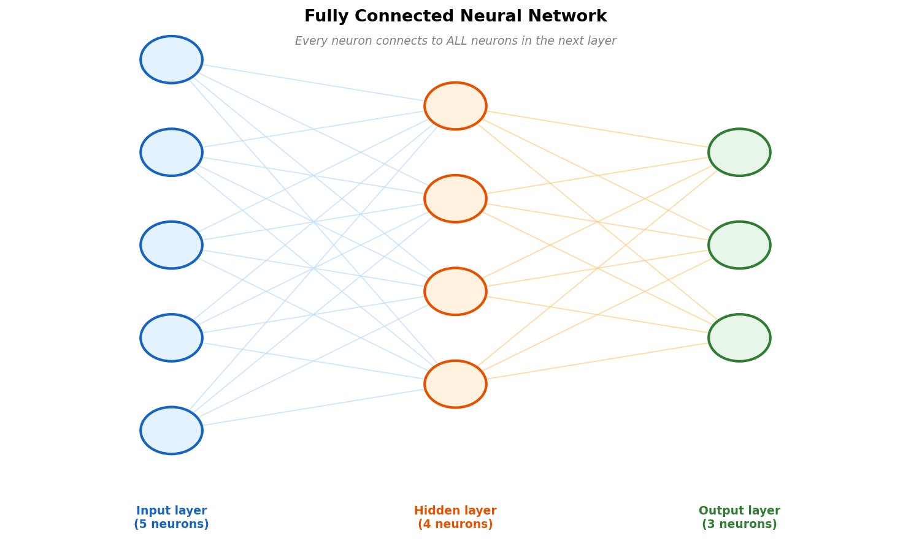
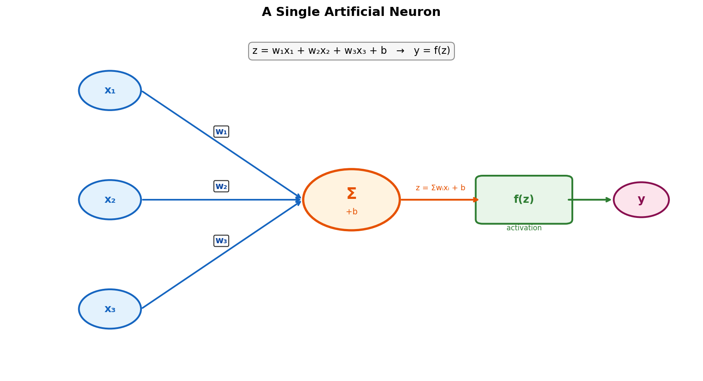
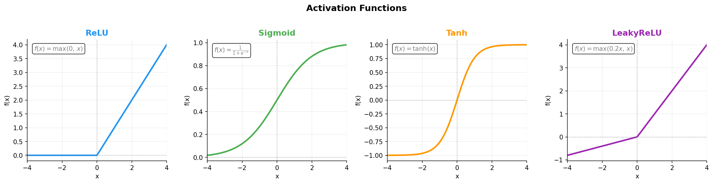
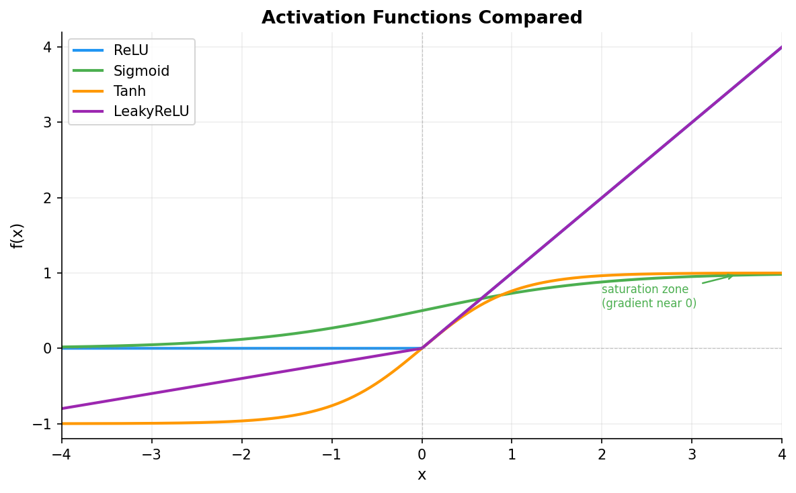
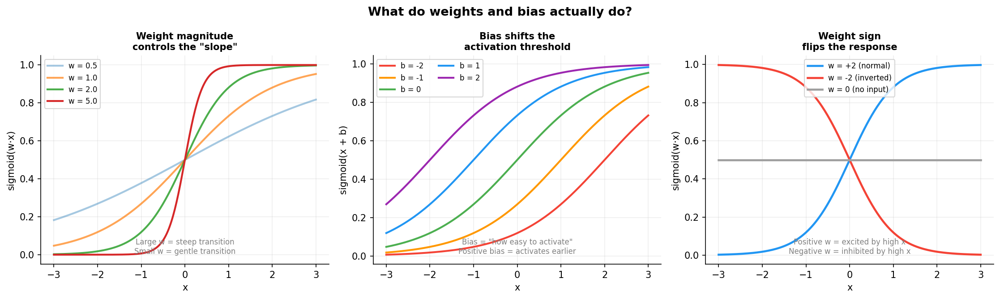

# Chapter 1: What on Earth Is an Artificial Neuron?

> *"The human brain has roughly 86 billion neurons. Our model has a few million
> parameters. And yet, our model knows that grass is green, which is more than
> some people figure out after 20 years of living."*

## 1.1 Before understanding AI, you need to understand one single neuron

It all starts with an idea from 1943. Two people, Warren McCulloch (a neurologist)
and Walter Pitts (an 18-year-old mathematician who basically lived in libraries),
asked themselves:

> *"What if we modelled a biological neuron as a mathematical function?"*

A biological neuron works simply:
- It receives signals from other neurons (through dendrites)
- If the sum of signals crosses a threshold, it "fires" and sends a signal forward (through the axon)
- Otherwise, it stays quiet

McCulloch and Pitts formalized this mathematically. But their model was too rigid:
everything was 0 or 1, fired or not. There was no concept of "almost activated".

The real breakthrough came in **1958**, when Frank Rosenblatt invented the
**perceptron** — the first artificial neuron that could actually *learn*.

## 1.2 The perceptron — the first neuron that passed an exam

A perceptron does this:

```
inputs:   x1, x2, x3, ...
weights:  w1, w2, w3, ...   (these are learned!)
bias:     b                  (this too)

compute:  z = w1*x1 + w2*x2 + w3*x3 + ... + b
output:   if z > 0  ->  1 (yes)
          if z <= 0 ->  0 (no)
```

Think of it as a bank employee deciding whether to approve a loan. They receive
information (income, age, credit history), each carrying a certain importance
(weight), and if the weighted sum clears a threshold, they approve.

**Weights** are what make a neuron smart or dumb. They start random (the new
employee knows nothing). Through training they adjust until the neuron makes
correct decisions.

## 1.3 The XOR problem and the first AI winter

In 1969, Minsky and Papert published a book proving that a single perceptron
**cannot solve the XOR problem**.

XOR is simple: the output is 1 if exactly one input is 1, otherwise 0:

```
0 XOR 0 = 0
0 XOR 1 = 1
1 XOR 0 = 1
1 XOR 1 = 0
```

A perceptron draws a straight line in space to separate two classes. XOR cannot
be separated by a straight line. Therefore: impossible.

The world concluded that artificial neurons were a dead end. Funding dried up.
The first "AI winter" arrived.

The **solution**, discovered later: stack multiple neurons in layers. One layer
can create curves. Two layers can create complex surfaces. Three layers can
approximate *any continuous function* (the universal approximation theorem).

## 1.4 The modern neural network



A modern neural network is, at its core, many neurons organized in layers:

```
Input layer -> Hidden layers -> Output layer
```

Every neuron in one layer connects to every neuron in the next. This is called
a **fully connected** or **dense** layer.

But wait. If we keep using z = wx + b and stack more layers, we are still doing
linear operations. And a sum of linear functions is still linear. What is the
point?

**Exactly none.** That is why we need activation functions.

## 1.5 Activation functions — injecting non-linearity



*A single neuron: inputs x are weighted, summed with the bias, and passed through
an activation function f(z) to produce the output y.*

An activation function transforms the output of a neuron before passing it forward.
Without it, a network of 100 layers is mathematically equivalent to a single layer.
With it, the network can model arbitrarily complex relationships.





### ReLU (Rectified Linear Unit)

`f(x) = max(0, x)`

The most widely used activation. If x is positive, it passes through unchanged.
If x is negative or zero, the output is 0.

Why is it good? It is simple, fast, and does not suffer from the vanishing gradient
problem (explained below). The downside: "dead neurons". If a neuron's input is
always negative, its output is always 0 and it never contributes to anything.

### Sigmoid

`f(x) = 1 / (1 + exp(-x))`

Maps any input to the interval (0, 1). Useful when you want a probability as
output. The discriminator in our GAN uses sigmoid internally to produce its
real/fake judgment.

Problem: for very large or very small values of x, the gradient is nearly zero.
The network stops learning in those regions. This is called **vanishing gradient**.

### Tanh

`f(x) = tanh(x)`

Like sigmoid but centered at 0, with output range (-1, 1). Negative outputs are
possible, which helps in intermediate layers. Our generator uses Tanh at its
final layer because the predicted ab values are normalized to (-1, 1) in the
LAB color space (see Chapter 6).

### LeakyReLU

`f(x) = x  if x > 0,  else 0.2 * x`

ReLU with a small "leak" for negative values. Fixes the dead neuron problem.
The PatchGAN discriminator in our project uses LeakyReLU with factor 0.2.
Discriminators benefit from active gradients across the full input range, so
the small negative slope keeps things flowing even on the negative side.

## 1.6 What weights and bias actually do

This is the part most tutorials skip. Let us make it concrete.



**Weight magnitude** (left panel): a large weight makes the activation function's
transition steep. The neuron reacts sharply to small changes in input. A small
weight makes the transition gradual.

**Bias** (middle panel): the bias controls the neuron's activation threshold.
Concretely, it slides the entire S-curve horizontally along the x-axis.
A positive bias slides it to the left, so the neuron activates at lower input
values (it fires more easily). A negative bias slides it to the right, requiring
a stronger input to fire.

Another way to see it: at any fixed input x, changing the bias changes the
output up or down. Either interpretation is valid. What matters intuitively is
this: the bias is the neuron's "resting opinion" before it sees any input.
A large positive bias means "I lean toward firing by default". A large negative
bias means "I need convincing".

**Weight sign** (right panel): a positive weight means the neuron is excited by
a high input value. A negative weight means it is inhibited. Flipping the sign
flips the response completely.

During training, the network adjusts all of these automatically to minimize
the loss. That is the subject of Chapter 2.

## 1.7 Vanishing gradient — when deep layers stop learning


Backpropagation (Chapter 2) computes the gradient at each layer by multiplying
terms together via the chain rule. If each term is less than 1, the product
shrinks exponentially as you go deeper.

With Sigmoid, the maximum gradient is 0.25. Through 8 layers:
0.25^8 = 0.000015 — effectively zero. The earliest layers receive no useful
signal and learn nothing.

With ReLU, the gradient is 1 for any positive input — it does not shrink. Deep
networks with ReLU can actually be trained.

This is one of the key reasons why ReLU is the default choice for hidden layers
in modern networks.

## 1.8 Why fully connected layers do not work for images

Our input image is the L channel at 256x256 pixels: 65,536 values. A single
fully connected neuron in the first layer would need 65,536 weights just for
one connection. With 1,000 neurons in that layer: 65 million parameters, just
for the first layer.

Beyond being expensive, it is also conceptually wrong. A neuron in the middle of
the network "knows" about the top-left corner as much as the bottom-right corner,
even though they have nothing to do with each other.

For images, we use convolutions. That is the story of Chapter 3.

## Summary

| Concept | What it means |
|---------|---------------|
| Artificial neuron | A function: z = sum(wi * xi) + b, followed by an activation |
| Weights | The numbers the model *learns* |
| Bias | Shifts the activation threshold; the neuron's default disposition |
| Activation function | Injects non-linearity: ReLU, Sigmoid, Tanh, LeakyReLU |
| Fully connected layer | Every neuron connected to all neurons in the next layer |
| Vanishing gradient | Gradients shrinking to zero in deep layers (Sigmoid problem) |
| Parameters | Total of all weights and biases in a model |

*Continue to [Chapter 2: How a model learns](chapter_02_learning.md)*
