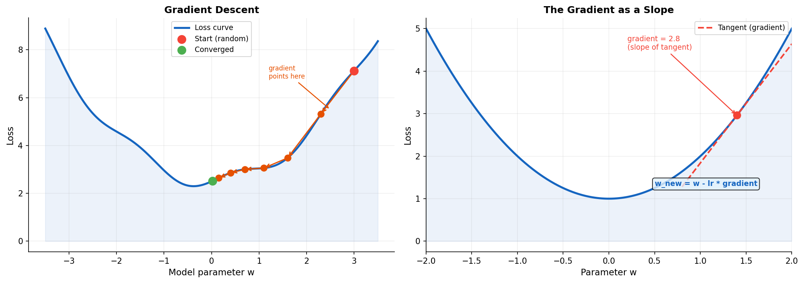
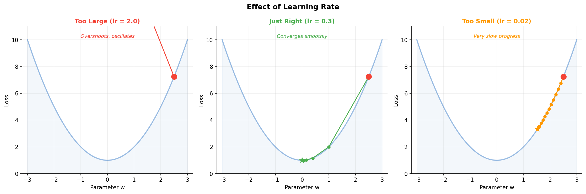
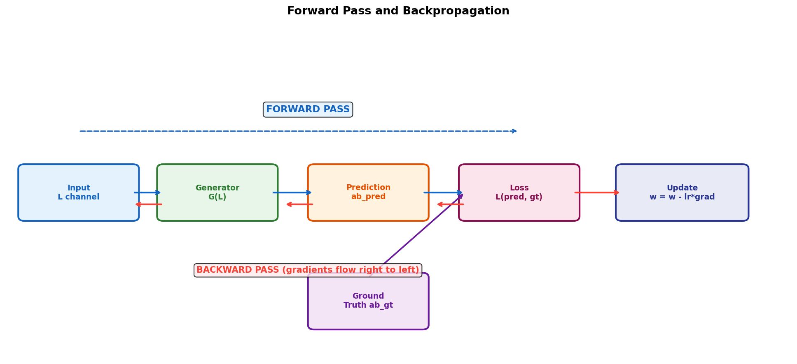
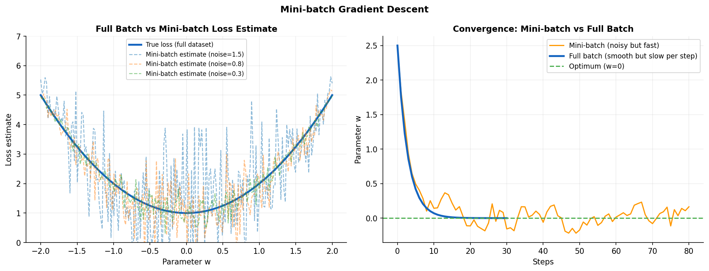
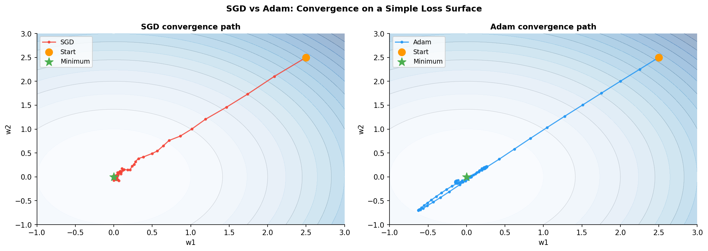
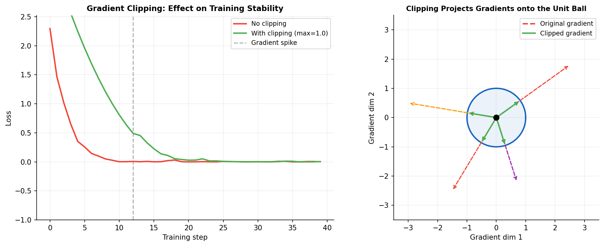

# Chapter 2: How a Model Learns

> *"Training a model is like raising a child: you give feedback, hope it improves,
> and eventually realize you misconfigured the learning rate from the start."*

## 2.1 The fundamental question: how does the model know it is wrong?

You have a model with millions of parameters. You feed it a grayscale image and
it produces something colorized. But how do you know if the colorization is good
or bad?

You need a **loss function**: a mathematical formula that turns "how wrong is the
model" into a single number.

If the model is perfect, loss = 0.
If the model is bad, loss is large.

The goal of training: **minimize the loss**.

## 2.2 The loss function

The simplest loss: **Mean Absolute Error (L1)**

```
L1 = (1/N) * sum( |prediction - ground_truth| )
```

The model predicts that pixel (100, 100) has color (a=0.3, b=-0.1).
The ground truth is (a=0.5, b=0.2). The error is:

```
|0.3 - 0.5| + |-0.1 - 0.2| = 0.2 + 0.3 = 0.5
```

Do this for every pixel in every image in a batch, take the average, and you
get the loss. One number summarizing "how bad you are right now".

For colorization, L1 has a known problem: if grass could be light green,
medium green, or dark green, the model predicts the *average* of all plausible
colors. A dull, desaturated green. Technically correct, perceptually boring.
That is why we use more sophisticated loss functions (Chapter 8).

## 2.3 The gradient



*Left: a ball rolling down the loss curve toward the minimum, one gradient step
at a time. Right: the gradient is the slope of the tangent at any point. It tells
you which direction makes the loss go up, so you go the other way.*

Now that we have a number (the loss), how do we reduce it?

Imagine you are on a foggy mountain and want to reach the valley (loss = 0).
You cannot see far, only what is directly around you. The best strategy: feel
the slope and step in the steepest downward direction.

The **gradient** is exactly that: for each parameter in the model, it says
*how much and in which direction* that parameter needs to change to reduce the loss.

Mathematically, the gradient with respect to parameter w is the partial derivative:

```
dLoss/dw
```

If dLoss/dw > 0, increasing w increases the loss, so decrease w.
If dLoss/dw < 0, increasing w decreases the loss, so increase w.

**The update rule:**
```
w_new = w_old - lr * (dLoss/dw)
```

where **lr** is the **learning rate**: the size of the step.

## 2.4 Learning rate



*Too large: the model overshoots the valley and bounces around. Too small: progress
is so slow you will still be waiting next week. Just right: smooth convergence.*

The learning rate controls how much you adjust the parameters at each step.

**Too large (lr = 2.0):** giant steps on the mountain. You jump over the valley.
Loss oscillates or explodes.

**Too small (lr = 0.00001):** tiny steps. You will get there eventually, if
you have unlimited time and cloud budget.

**Just right (lr = 2e-4 in our project):** you reach the valley reasonably fast
without jumping past it.

There is no universal value. It is empirical. It is art. It is frustration.

We use lr = 1e-4 in pretraining and lr = 2e-4 in the GAN phase, with
**ReduceLROnPlateau**: if PSNR stops improving for 3 epochs, the learning rate
is automatically halved. The model "brakes" as it approaches convergence.

## 2.5 Backpropagation



*Blue arrow: the forward pass. The input travels through the network and
produces a prediction. The loss compares prediction to ground truth.
Red arrows: the backward pass. Gradients flow right to left through every layer.
Each parameter receives its gradient and is updated.*

A neural network is a composed function: f(g(h(x))). To compute dLoss/dw for
a parameter buried deep in the network, we use the **chain rule** from calculus:

```
dLoss/dw = (dLoss/d_output) * (d_output/d_prev_layer) * ... * (d_layer/dw)
```

Backpropagation is the algorithm that applies this rule efficiently, computing
gradients from output back toward input (hence "back").

**Forward pass:** the image travels through the entire network, producing a prediction.
**Loss computation:** compare prediction to ground truth.
**Backward pass:** compute gradients for every parameter, from output toward input.
**Update:** adjust every parameter using its gradient.

This is one **training iteration**. You do this thousands of times.

## 2.6 Vanishing gradient

The chain rule multiplies many terms together. If each term is less than 1
(which happens with Sigmoid and Tanh for extreme values), their product shrinks
toward zero.

Result: parameters in early layers receive near-zero gradients and learn nothing.
The network grows deeper, but only the last few layers actually do anything useful.

Solutions:
- **ReLU:** gradient is 1 for positive inputs, does not shrink
- **Skip connections (ResNet):** provide a direct path for gradients, bypassing intermediate layers (Chapter 4)
- **Gradient clipping:** prevents the opposite problem, gradients exploding

## 2.7 Mini-batches



*Left: a mini-batch gives a noisy estimate of the true loss curve, but that is
acceptable. Right: mini-batch converges faster per wall-clock time than full batch,
even though each step is noisier.*

Computing the gradient on all 10,400 training images before updating? That is
**full batch gradient descent**: slow and memory-intensive.

The alternative: pick a random subset of images (**mini-batch**), compute the
gradient on those, update, repeat.

We use **batch size = 16:** 16 images per iteration. Each 256x256 image is
roughly 200KB. 16 images fits comfortably on a T4 GPU.

One **epoch** is one complete pass through the dataset:
- 10,400 training images / batch size 16 = 650 iterations per epoch

## 2.8 Adam

Plain SGD (Stochastic Gradient Descent):
```
w = w - lr * gradient
```

Works, but is slow and sensitive to learning rate choices.

**Adam** (Adaptive Moment Estimation, 2014) is smarter. It tracks two things:

- **m** (first moment): a moving average of the gradients, the general direction of travel
- **v** (second moment): a moving average of the *squared* gradients, how much the direction varies

Update rule:
```
m = b1*m + (1-b1)*gradient          (b1 = 0.9 typically)
v = b2*v + (1-b2)*gradient^2        (b2 = 0.999 typically)

w = w - lr * m_hat / (sqrt(v_hat) + epsilon)
```

The effect: Adam adapts the learning rate per parameter. Parameters that vary
a lot get smaller steps. Stable parameters get larger steps. It self-calibrates.



*Both start at the same point and target the same minimum (green star).
Adam's path is more direct. SGD's path is noisier and takes more steps to converge
in this noisy setting.*

**Why b1 = 0.5 in our GAN?**

Standard Adam uses b1 = 0.9, which gives a long memory of past gradient directions.
In GAN training, the loss landscape shifts rapidly as generator and discriminator
evolve together. A long memory means the optimizer follows an old direction when
the landscape has already changed. Using b1 = 0.5 shortens the memory, allowing
faster responses to shifts in the adversarial dynamics.

## 2.9 Gradient clipping



*Left: without clipping, a single large gradient spike at step 12 destroys the
training run. With clipping, the spike is absorbed and training continues.
Right: geometrically, clipping projects any gradient outside the unit sphere
back onto its surface, preserving direction but capping magnitude.*

Sometimes gradients explode: enormous values that send parameters completely off
track. This is especially common when unfreezing a frozen backbone mid-training,
exactly what happens in Phase 2 of our uncertainty model.

**Gradient clipping:** if the norm of the gradient vector exceeds a threshold,
scale all gradients proportionally so the norm equals the threshold.

```python
torch.nn.utils.clip_grad_norm_(model.parameters(), max_norm=1.0)
```

If the gradient norm is 5.0 and max_norm is 1.0, all gradients are divided by 5.
Direction is preserved, magnitude is controlled.

We apply this after every backward pass on the generator during uncertainty training.

## 2.10 Putting it all together

```
1. Forward pass:   ab_pred = G(L)
2. Compute loss:   loss = L1(ab_pred, ab_real) * 100
3. Zero gradients: optimizer.zero_grad()
4. Backward pass:  loss.backward()
5. Clip gradients: clip_grad_norm_(G.parameters(), max_norm=1.0)
6. Update:         optimizer.step()
```

Repeat 650 times per epoch, 20 epochs per stage. That is 13,000 iterations
per training stage, and roughly 3.5 hours on a T4 GPU.

If the learning rate is wrong or the loss explodes? You start over.

## Summary

| Concept | What it means |
|---------|---------------|
| Loss function | A number measuring how wrong the model is right now |
| Gradient | Direction and magnitude of required change per parameter |
| Learning rate | The size of each update step |
| Backpropagation | Algorithm that computes gradients using the chain rule |
| Mini-batch | A subset of data per iteration (we use 16 images) |
| Epoch | One complete pass through the dataset |
| Adam | Adaptive optimizer that adjusts lr per parameter |
| Gradient clipping | Caps gradient magnitude to prevent training instability |

*Continue to [Chapter 3: Convolutional Networks](chapter_03_cnn.md)*
