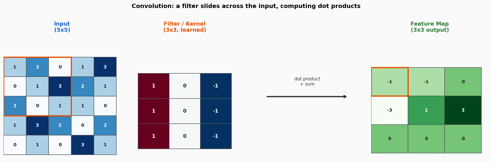
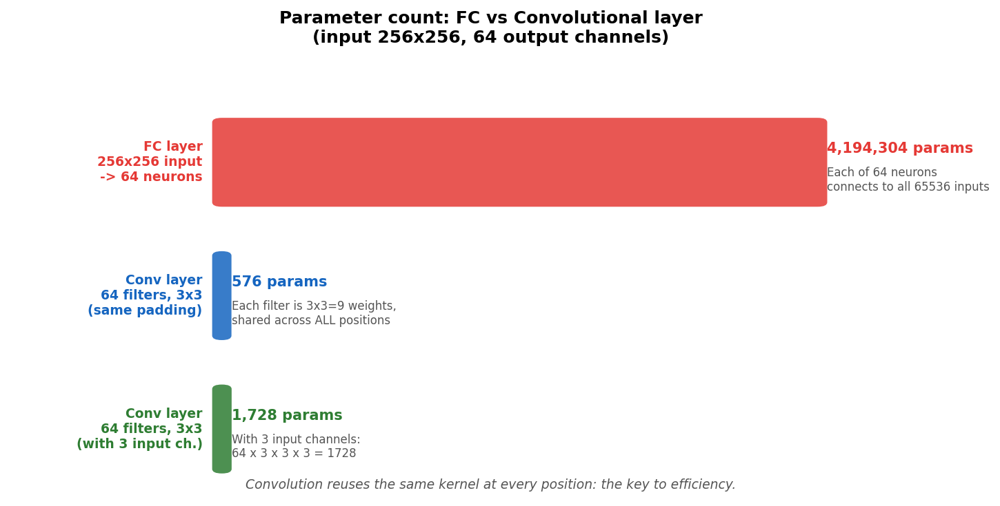
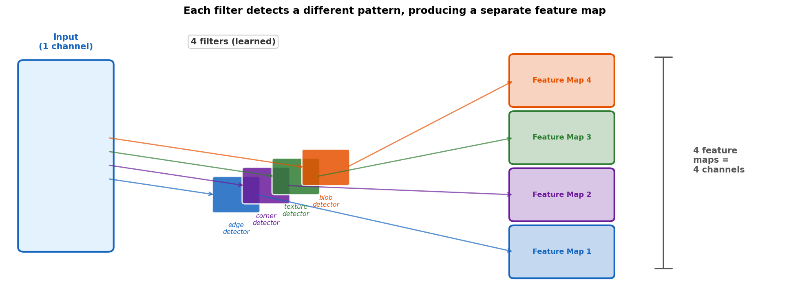
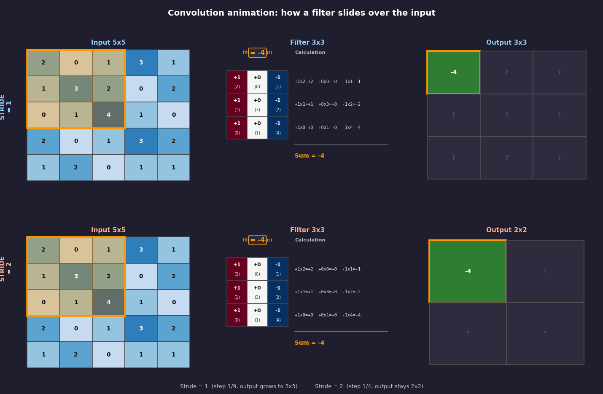
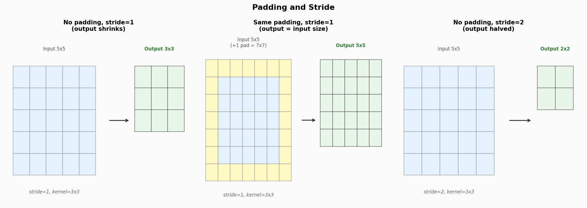
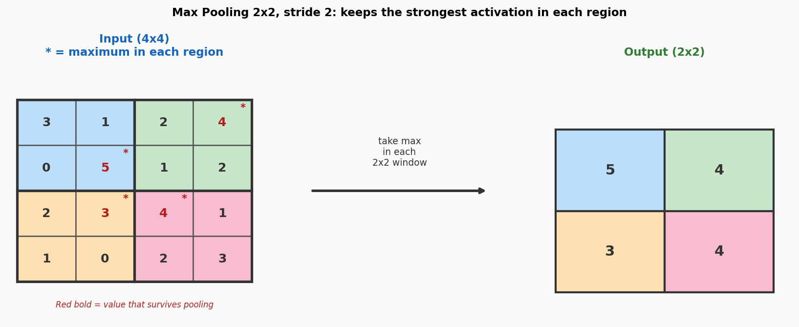
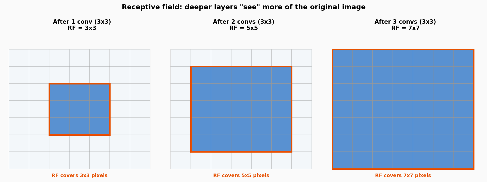
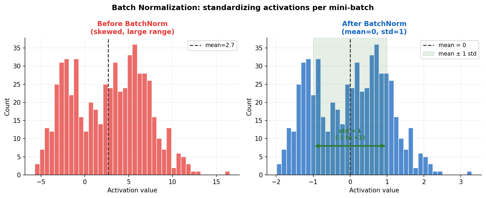
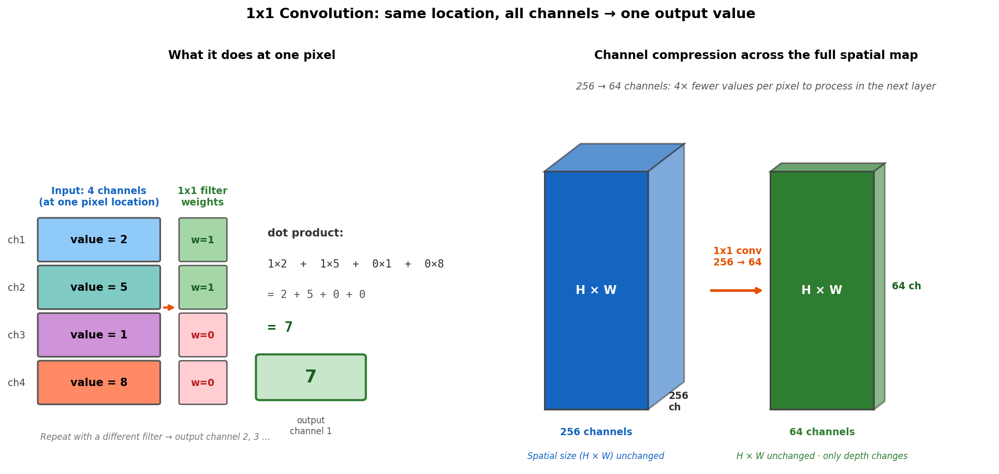

# Chapter 3: Convolutional Networks

> *"If you tried to connect every pixel of a 256x256 image to a neural network using
> fully connected layers, you would need roughly 200 million parameters just for the
> first layer. Convolutions get the same job done with a few hundred. Someone was
> actually thinking."*

## 3.1 The problem with fully connected layers and images

Chapter 1 ended with a warning: fully connected layers do not scale to images.
Here is the full story.

An image is 256x256 pixels. That is 65,536 numbers. If the first hidden layer has
just 64 neurons, and every neuron connects to every input pixel, that is:

```
65,536 x 64 = 4,194,304 parameters
```

Just for one layer. One. Those parameters all have to be stored, loaded into GPU
memory, and updated on every training step. Add a few more layers and you have
run out of both memory and patience.

But the deeper problem is not memory. It is ignorance.

A fully connected layer has no concept of space. It does not know that pixel
(100, 100) is next to pixel (100, 101). It sees a flat list of 65,536 numbers,
all equally mysterious, all connected to everything. To learn that cats have ears,
grass has texture, and sky is at the top, the network would need to rediscover
spatial structure from scratch using millions of examples. That is a lot of work
for something that is obvious from the definition of an image.

The solution: stop ignoring what we already know. Images have local structure.
Nearby pixels are related. Patterns repeat across positions. Bake this into the
architecture. Use **convolutions**.

## 3.2 What a convolution actually does



*A 3x3 filter slides across a 5x5 input. At each position, every element of the
filter is multiplied by the corresponding input pixel and the results are summed.
This single number becomes one entry in the output feature map. The orange border
shows the current filter position; the orange cell in the output is the result.*

A convolution is a sliding dot product.

You have a small matrix called a **filter** or **kernel**, typically 3x3. You
place it over a patch of the input. Multiply each filter value by the pixel
underneath it. Sum all nine products. That sum becomes one value in the output.

Then you slide the filter one step to the right and do it again. And again. When
you reach the right edge, drop down one row and start from the left. By the time
the filter has visited every valid position, the output grid is complete.

For a 5x5 input with a 3x3 filter and no padding:
```
output size = (input size - kernel size) + 1 = 5 - 3 + 1 = 3
```

The critical insight: **the filter weights are the same at every position**. A
single set of 9 numbers is reused across the entire image. This is called
**weight sharing**, and it is the reason convolutions are so efficient.



*A fully connected layer connecting a 256x256 input to 64 neurons needs over
four million parameters. A convolutional layer producing 64 feature maps with
3x3 filters needs 576. The difference is weight sharing: those 9 numbers per
filter are reused at every pixel.*

Weight sharing also makes intuitive sense. A filter that learns to detect a
vertical edge should fire wherever a vertical edge appears: top-left, center,
bottom-right, anywhere. The same 9 weights work everywhere. This property is
called **translational equivariance**: move the object, the response moves
with it.

A fully connected neuron has no such generalization. It learns that pixel number
31,847 is sometimes dark. That is not a transferable skill.

## 3.3 What do filters detect?

A single filter produces a single **feature map**: a 2D grid whose values say
"how strongly does each location in the input match this filter's pattern?"



*Four filters run in parallel, each detecting a different pattern, each producing
its own feature map. Stack all four maps and you get a volume:
height x width x 4 channels.*

Nobody hand-designs the filters. They start as random noise and are shaped by
backpropagation to extract whatever is useful for the task. In practice, the
first layer of a network trained on images consistently learns:

- Horizontal edges (bright above, dark below)
- Vertical edges (bright left, dark right)
- Diagonal edges at various angles
- Color transitions

Deeper layers combine these to detect increasingly abstract things:

- Layer 2: corners, junctions, curves
- Layer 3: textures (fur, brick, fabric)
- Layer 4: object parts (eyes, wheels, windows)
- Layer 7+: entire semantic categories

For colorization, the encoder needs to learn "this region is sky," "this is
human skin," "this is grass." These semantic filters are what makes the model
produce plausible colors instead of random hues. A model that cannot distinguish
sky from ground cannot know that one is blue and the other is green.

## 3.4 Padding and stride



*Top row: stride=1. The filter moves one step at a time. 9 positions total,
output is 3x3. Bottom row: stride=2. The filter jumps two steps at a time.
4 positions total, output is 2x2. Same filter, same input, different step size.
Orange border: current filter window. Numbers inside: weight (input pixel).
Green cells: computed output values.*

Two parameters control the output size:

**Padding** adds a border of zeros around the input before applying the filter.
With `padding=1` and a 3x3 kernel, every border pixel gets the same treatment
as interior pixels, and the output is the same size as the input. This is called
"same" padding. Without padding, the output shrinks by `kernel_size - 1 = 2`
pixels on each side.

**Stride** controls how far the filter jumps at each step.

- `stride=1`: move one pixel, visit every position
- `stride=2`: jump two pixels, visit half the positions, output is half the size

The output size formula with both:
```
output size = floor((input size + 2*padding - kernel size) / stride) + 1
```

Example: 5x5 input, 3x3 kernel, padding=0, stride=2:
```
floor((5 + 0 - 3) / 2) + 1 = floor(1) + 1 = 2
```
That is a 2x2 output. The animation shows exactly this.



*Left: no padding, stride=1, output shrinks (5x5 becomes 3x3). Center: same
padding, stride=1, output stays 5x5. Right: no padding, stride=2, output halves
(5x5 becomes 2x2).*

In our colorization model, stride=2 is used in the encoder to shrink the image
step by step (256x256 to 128x128 to 64x64...) and the decoder does the reverse.
The exact details of how that works is Chapter 5. For now, remember: stride is
the gas pedal for how fast the spatial size drops.

## 3.5 Pooling



*Max pooling 2x2, stride 2: the 4x4 input is split into four non-overlapping
2x2 regions (colored differently). The maximum value in each region is kept.
The output is 2x2: half the size in each dimension.*

**Max pooling** keeps only the largest value in each local window and throws the
rest away. A 2x2 max pool with stride 2 halves both spatial dimensions.

Why the maximum? Think of it this way. Suppose you have a filter that detects
eyes. After the convolution, each pixel in the feature map says "how eye-like is
this spot?" Now you apply 2x2 max pooling. Each 2x2 region returns one number:
the strongest eye-detection in that region. You do not care whether the eye was
at position (0,0) or (1,1) within that 2x2 block. You only care that there was
an eye somewhere nearby. That is the semantics of taking the max.

This property has a name: **local translation invariance**. Shift an object by
one pixel and the max pooled output does not change, as long as the peak stays
in the same region. This makes the network robust to small spatial jitter.

A subtle difference from strided convolution: max pooling is fixed ("take the
max, always"), while a strided convolution learns what to keep. Both halve the
size. Modern architectures increasingly prefer strided convolutions because
they are more flexible, but max pooling is still used where invariance is
explicitly desired.

## 3.6 The receptive field

First: where are the neurons in all of this?

In a fully connected layer, a neuron is a circle with lines going to every input.
Easy to draw and hopefully to understand too. In a CNN, it looks different but the idea is the same:

**Every single value in the output feature map is the output of one neuron.**

When the filter sits at position (row=0, col=0) and computes a dot product, that
result is the output of neuron (0,0). When the filter moves to (row=0, col=1)
and computes another dot product, that is neuron (0,1). The filter slides 9 times
across a 5x5 input and produces a 3x3 feature map. That is 9 neurons.

Each neuron has the same weights (the filter). It just looks at a different
patch of the input. Think of it as 9 copies of the same neuron, each assigned
to a different region of the image.

```
Output feature map (3x3):
┌───────┬───────┬───────┐
│ n(0,0)│ n(0,1)│ n(0,2)│   <- each cell is one neuron's output
├───────┼───────┼───────┤
│ n(1,0)│ n(1,1)│ n(1,2)│
├───────┼───────┼───────┤
│ n(2,0)│ n(2,1)│ n(2,2)│
└───────┴───────┴───────┘

n(0,0) looked at: input[0:3, 0:3]   (top-left 3x3 patch)
n(0,1) looked at: input[0:3, 1:4]   (shifted one right)
n(1,1) looked at: input[1:4, 1:4]   (center 3x3 patch)
```

The **receptive field** of a neuron is exactly that patch it looked at in the
original input. For n(0,0) in layer 1: 3x3 pixels. Simple.

But what does a neuron in the **second** layer see?

The second layer applies its filter to the first layer's feature maps. Neuron
n(1,1) in layer 2 looks at a 3x3 patch of layer 1's output. But each of those
9 layer-1 values was already computed from a 3x3 patch of the original image.
So layer 2's neuron is indirectly influenced by a larger region of the input.

Here is the chain, step by step:

```
Original input (5x5):
┌─────────────────┐
│ . . . . .       │
│ . X X X .       │  <- layer 1 neuron n(0,0) looked at this 3x3 patch
│ . X X X .       │     and produced one value: v(0,0)
│ . X X X .       │
│ . . . . .       │
└─────────────────┘

Layer 1 output (3x3):
┌─────────────┐
│v(0,0) v(0,1)│  <- layer 2 neuron looks at a 3x3 patch of THIS
│v(1,0) v(1,1)│     but v(0,0) came from a 3x3 patch of the input,
│v(2,0) v(2,1)│     and v(0,1) came from a SHIFTED 3x3 patch...
└─────────────┘

So layer 2 neuron n(0,0) is influenced by:
┌─────────────────┐
│ Y Y Y Y .       │
│ Y Y Y Y .       │  <- 4x4? Actually 5x5 at the edges...
│ Y Y Y Y .       │     = 5x5 region of the original input
│ . . . . .       │
└─────────────────┘
```

The union of all the 3x3 patches that fed into the 3x3 layer-1 region that
layer 2 reads is a 5x5 region. Add another layer and it becomes 7x7.

Think of it like gossip in a village. One person hears something and tells
three neighbors. Each of those tells three more. By the third round, the
information has spread to a large neighborhood, even though each conversation
was only one-on-one.



*Blue cells: all the original input pixels that influence the output neuron at
the center (orange border). After 1 conv: only the immediate 3x3 window.
After 2 convs: 5x5. After 3: 7x7. Each layer adds one pixel of context on
every side.*

The **receptive field** is the region of the original input that can influence
one output neuron. It grows by 2 pixels per side per 3x3 layer:

```
RF after n layers of 3x3, stride=1 = 1 + 2*n
```

After 3 layers: 7x7. After 10 layers: 21x21. With stride=2, every downsampling
doubles the effective growth rate: one step in the downsampled map corresponds
to two pixels in the input, so the field expands twice as fast.

This is why depth matters. The first layer sees edges. The second sees corners.
The fifth sees textures. The tenth sees semantic regions like "sky" or "face."
For colorization: you cannot decide that something is sky-blue if you can only
see a 7x7 patch of it. You need to see enough context to even know it is sky.

## 3.7 Batch Normalization



*Left: raw activations from one layer, spread all over the place (mean around
2.7, ranging from -6 to +17). Right: after BatchNorm, every activation is
standardized to mean=0, std=1. The green shaded band shows the mean +/- 1 std
region: exactly 68% of values fall in [-1, +1] by construction.*

Without BatchNorm, the distribution of activations at each layer depends on
every weight in every layer before it. Change one early weight and all the
downstream distributions shift. The next layer woke up expecting one kind of
input and gets another. This is called **internal covariate shift**, and it
is why training very deep networks used to feel like herding cats.

**Batch Normalization** (2015) fixes this by standardizing activations over
the current mini-batch at every layer, on every forward pass:

```
x_norm = (x - mean_batch) / (std_batch + epsilon)
output  = gamma * x_norm + beta
```

The formula in plain English: subtract the batch mean (center at zero), then
divide by the batch standard deviation (scale to unit variance). Done.

**Concrete example** with a mini-batch of 4 activations: `[3, 7, 5, 9]`

```
mean = (3 + 7 + 5 + 9) / 4 = 6.0
std  = sqrt(((3-6)^2 + (7-6)^2 + (5-6)^2 + (9-6)^2) / 4) = sqrt(5) = 2.24

x_norm = [(3-6)/2.24,  (7-6)/2.24,  (5-6)/2.24,  (9-6)/2.24]
       = [-1.34,        0.45,        -0.45,         1.34]
```

The output values are now centered at 0 and have standard deviation 1,
regardless of where they started. Every layer gets a clean, predictable
distribution every time.

`gamma` and `beta` are learnable parameters that let the network rescale and
shift the normalized values if the task requires a different range. The network
can technically undo the normalization entirely, but it starts from a sane
default.

One subtlety: during training, `mean` and `std` are computed on the mini-batch.
During **inference** (the step where you actually use the trained model to make
predictions, rather than training it), you might feed just one image at a time.
Computing mean and std over a single sample is meaningless. So during inference,
BatchNorm uses running averages accumulated across all mini-batches during
training instead. The model keeps a memo: "on average, activations at this layer
had mean X and std Y." That memo is used at inference time.

This is why a very small batch size during training makes BatchNorm noisy: the
per-batch statistics fluctuate wildly, and the running averages become unreliable.

## 3.8 Why ReLU? The linearity problem

Every modern CNN block looks like this:

```
Input feature map
  -> Conv2d(in_ch, out_ch, kernel_size=3, padding=1)
  -> BatchNorm2d(out_ch)
  -> ReLU()
  -> [repeat]
Output feature map
```

The Conv and BatchNorm steps are **linear operations**: multiply by a matrix,
add a bias, scale. If you stack ten of them with no activation in between, the
whole thing is equivalent to one big matrix multiplication. All that depth
collapses into a single linear layer.

Linear functions can only represent linear relationships. A line. A flat plane.
No curves, no boundaries, no "if the input is in this range do this, otherwise
do that." Nearly every useful pattern in images is non-linear.

**ReLU** breaks the linearity. It does something laughably simple:

```
ReLU(x) = max(0, x)
```

If the value is positive, pass it through. If it is negative or zero, set it
to zero. That is the entire function. One line of math. No parameters.

But this tiny asymmetry is enough. A neuron that fires only when its input is
positive behaves differently from one with a negative input, and those two
behaviors can be combined by the next layer into arbitrarily complex
decision boundaries. Stack enough of these and the network can approximate
any function, in principle.

Why ReLU specifically and not something fancier? It is fast to compute, its
gradient is simply 1 (positive) or 0 (negative), and it does not saturate for
large positive values the way Sigmoid does. Sigmoid outputs 0.9999 for both
x=5 and x=50 -- the gradient is nearly zero and the network stops learning.
ReLU for x=50 outputs 50. Gradient = 1. Learning continues.

The tradeoff: neurons with negative input permanently output 0 and receive no
gradient. They are "dead." Leaky ReLU, discussed in Chapter 1, avoids this by
passing a tiny fraction of negative inputs through instead.

In our model, every encoder and decoder layer uses ReLU (or LeakyReLU in the
discriminator). The final output uses Tanh instead, to squash predictions into
the [-1, 1] range expected for LAB color values.

## 3.9 The 1x1 convolution

One last trick that sounds useless: a convolution with a 1x1 kernel.

A 1x1 kernel covers exactly one pixel. It cannot see neighbors. It cannot
detect edges or textures. So what is the point?

To understand it, you need to think about what a feature map actually is at
this stage. After several convolutional layers, the "image" is no longer
pixels. It is a volume: say, 64x64 spatially, but with 256 channels of depth.
At each of those 64x64 locations, there is a vector of 256 numbers, each one
saying "how strongly does feature X activate here?"

A 1x1 convolution operates on that 256-dimensional channel vector at each
location independently, mixing the channel values together to produce a
smaller or larger vector.



*Left: at one pixel location, the 1x1 filter is just a list of weights -- one
per input channel. It computes a weighted sum across all channels at that
location and produces one output value. Run 64 different 1x1 filters and you
get 64 output channels. Right: across the full spatial map, the spatial size
(H x W) is completely unchanged. Only the number of channels changes.*

Here is the key insight: **at each pixel, a 1x1 conv is just a dot product
between the filter weights and the channel vector at that location.** No
neighboring pixels are involved at all. It is the same math as a fully
connected layer, but applied independently at every single pixel.

```
At pixel (row=5, col=12):
  Input:  [ch1=2, ch2=5, ch3=1, ch4=8]    (256 values in practice)
  Filter: [w1, w2, w3, w4]                 (256 weights)
  Output: w1*2 + w2*5 + w3*1 + w4*8 = one number -> output channel 1

Apply a second filter -> output channel 2
Apply 64 filters      -> 64 output channels
Spatial size: unchanged. 64x64 in, 64x64 out. Only depth changed.
```

Why would you want this?

**1. Cheap channel compression.** A 3x3 conv on 256 channels costs 256 * 9
multiplications per output pixel. A 3x3 conv on 64 channels costs 64 * 9.
Use a 1x1 first to go 256 -> 64, run the expensive 3x3, then use another 1x1
to go back to 256. You get roughly the same result at a fraction of the cost.
This is the "bottleneck" design used in ResNet (Chapter 4).

**2. Channel count adjustment.** Skip connections in U-Net connect encoder
layers to decoder layers, but they often have different numbers of channels.
A 1x1 conv adjusts the depth without disturbing the spatial structure.

**3. Final output.** Our colorization generator ends with a 1x1 conv from
64 channels down to 2 (the `a` and `b` color channels), followed by Tanh.
No spatial mixing at all -- just "take all the features computed so far and
collapse them into two color values per pixel."

## Summary

| Concept | What it does |
|---------|--------------|
| Convolution | Slides a learned filter across the input, computing dot products |
| Weight sharing | Same filter reused at every position: O(k²) params, not O(H×W) |
| Feature map | 2D response of one filter across the full input; 64 filters → 64 feature maps |
| Padding | Zero-border that controls whether output shrinks (valid) or stays same size (same) |
| Stride | Step size of the filter; stride=2 halves the output dimensions |
| Max pooling | Keeps the maximum in each local region; adds local translation invariance |
| Receptive field | Region of the original input that influences one output neuron; grows with depth |
| Batch Normalization | Standardizes activations per mini-batch to stabilize training |
| 1x1 convolution | Mixes channels at each pixel without touching spatial structure |

## Glossary

| Term | What it means |
|------|---------------|
| **Inference** | Using a trained model to make predictions — not training it. No gradients, no weight updates, just a forward pass. BatchNorm uses stored running averages here instead of batch statistics. |
| **Translational equivariance** | Move the object in the input and its response moves the same way in the output. Convolutions have this by design: the filter is the same everywhere. |
| **Translational invariance** | Move the object slightly and the output does not change at all. Max pooling adds local invariance: small shifts within a pooling window produce the same result. |
| **Internal covariate shift** | The distribution of activations inside the network keeps shifting as training updates weights in earlier layers. BatchNorm prevents this by re-standardizing at each layer. |
| **Dead neuron** | A ReLU neuron whose input is always negative. It outputs 0, receives gradient 0, and never learns. Can happen with too-high learning rates or poor initialization. |
| **Bottleneck** | A layer that compresses the channel dimension (e.g., 256 → 64 with a 1x1 conv) before an expensive operation, then expands it back. Reduces cost without much loss in representational power. |
| **Downsampling** | Reducing spatial dimensions (H × W) using stride=2 or max pooling. Makes feature maps smaller and receptive fields larger. |
| **Upsampling** | Increasing spatial dimensions, used in decoder networks to restore original image size. Usually done with bilinear interpolation or transposed convolutions. |

*Continue to [Chapter 4: ResNet and Skip Connections](chapter_04_resnet.md)*
