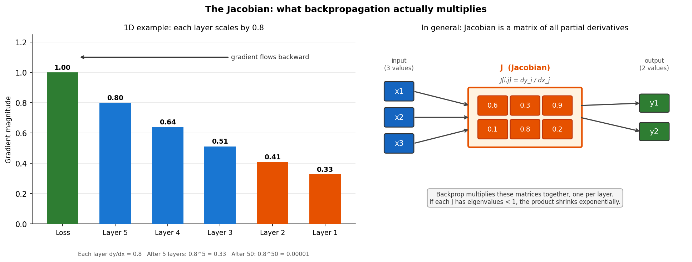
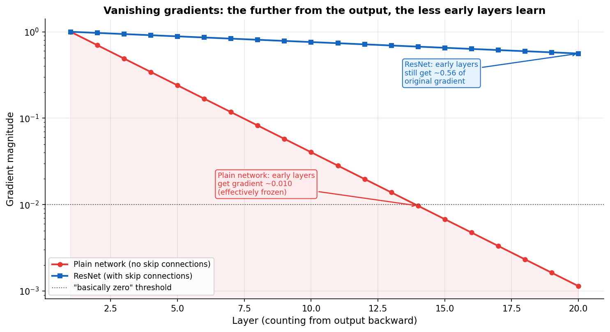
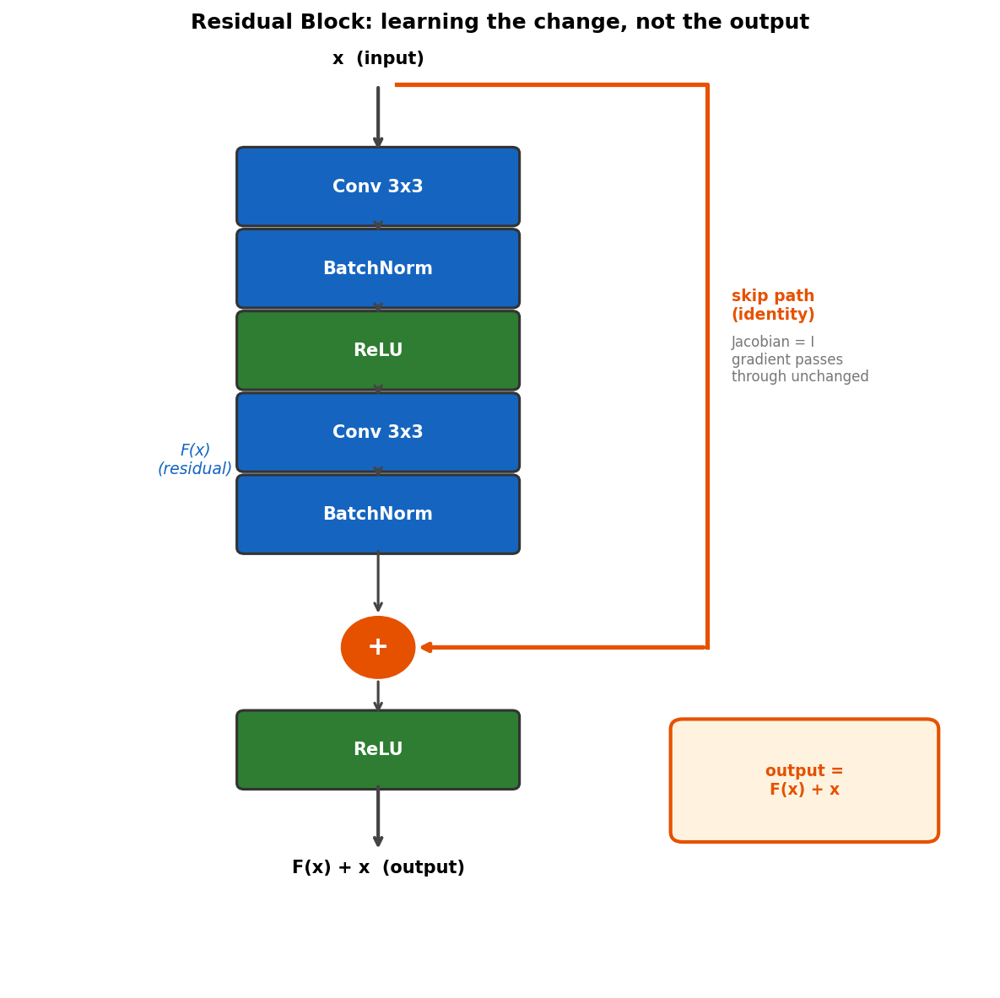
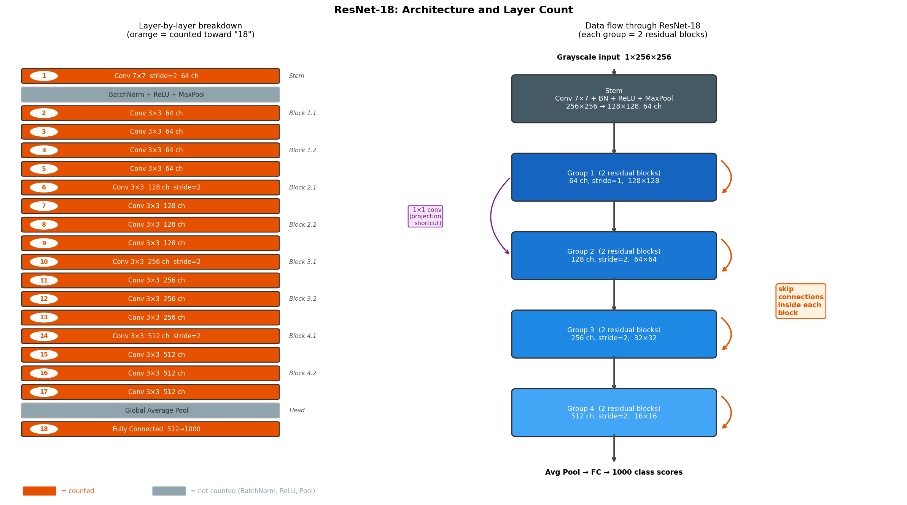
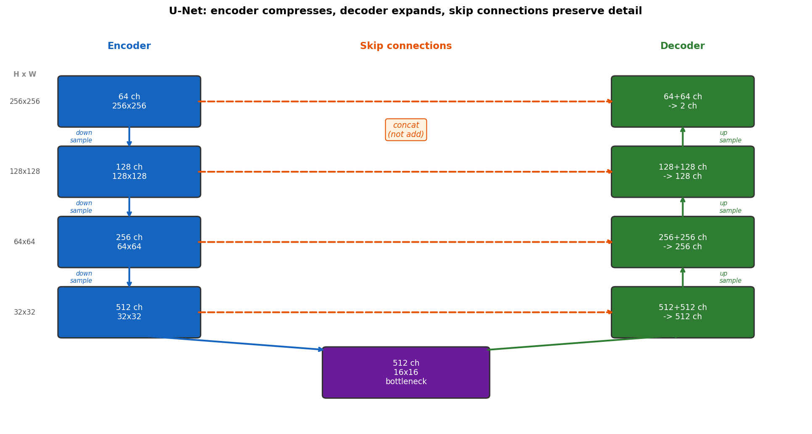

# Chapter 4: ResNet and Skip Connections

Chapter 3 ended with a reasonable question: if depth gives you a bigger receptive field and more abstract features, why not just add more layers?

Go ahead. Try it.

Train a 20-layer network, then a 56-layer network on the same data with the same optimizer. The 56-layer network will perform *worse*. Not on the test set, which you could blame on overfitting. On the *training* set. The deeper network literally cannot learn the training data as well as the shallower one. This is called the **degradation problem**, and for a few years it quietly embarrassed everyone who tried to build deeper networks.

The fix, when it came, was almost annoyingly simple.

---

## 4.1 What is H(x) and why is it hard to learn?

When a convolutional layer processes input `x`, it produces some output. Call that desired output `H(x)` - H is just a shorthand for "the function this block should implement." It could be an edge detector, a texture filter, a semantic concept. The network's job is to find weights so that the layer approximates H(x).

The problem kicks in when you stack 50 layers and try to train everything with backpropagation. By the time the gradient signal travels 50 layers backward, it has been multiplied by so many small numbers that it's effectively zero. The early layers don't get told how wrong they are. They stop learning.

This is the vanishing gradient problem. It's worth actually understanding why it happens, not just knowing that it does.

---

## 4.2 Why Gradients Vanish: the Jacobian

Backpropagation works by applying the chain rule. At each layer, it takes the incoming gradient and multiplies it by the **Jacobian**: a matrix that describes how much each output of that layer changes when you nudge each input.

Concretely: if a layer maps three inputs to two outputs, the Jacobian is a 2x3 matrix. Entry (i, j) is the partial derivative dy_i / dx_j - how sensitive output i is to input j.



*Left: a 1D example where each layer multiplies the gradient by 0.8. Right: in general, each layer has a Jacobian matrix. Backprop chains them together by multiplication, one matrix per layer.*

A matrix's **eigenvalues** tell you how much it stretches or shrinks a vector passing through it. An eigenvalue of 1.0 means no change. An eigenvalue of 0.9 means "multiply by 0.9." When you stack 50 layers and multiply their Jacobians together, the scaling compounds: 0.9 raised to the 50th power is 0.005. The gradient at layer 1 is two hundred times smaller than it was at the output. That layer learns almost nothing.

The Jacobian of a ReLU layer is a diagonal matrix - 1 where the neuron was active, 0 where it was not. A diagonal matrix full of 1s is called the **identity matrix**, and it is the matrix equivalent of multiplying by 1 - it leaves whatever passes through it completely unchanged. ReLU is better than sigmoid in this regard, but it doesn't fully solve the problem because you still have the linear layer's Jacobian multiplied in at each step.



*Plain network (red): gradient magnitude drops exponentially and effectively dies before reaching the early layers. ResNet (blue): the skip connections provide a parallel path whose Jacobian is the identity matrix, keeping the gradient alive throughout.*

Careful initialization and batch normalization help. They delay the problem. With very deep networks, they don't eliminate it.

---

## 4.3 The Fix: Just Add the Input Back

He et al. (2016) proposed something that feels too simple to work.

Instead of asking the block to learn H(x), ask it to learn the **residual**: the difference between what you want and what you already have.

```
F(x) = H(x) - x
```

Then at the end of the block, add back the input you started with:

```
output = F(x) + x
```

The "+" is the **skip connection**. The input x goes around the conv layers and gets added back at the end. The network only has to learn *what needs to change*, not the full answer from scratch.

That's the whole idea. They won ImageNet with it.



*The orange path is the skip connection. x travels around the conv layers and gets added back at the addition circle. The conv layers only have to learn the correction F(x), not the full desired output.*

### Why this actually works

The gradient now has two routes backward. It can go through the conv layers, or it can go through the skip connection. The skip path is just an addition, so what is its Jacobian?

If `output = F(x) + x`, then the partial derivative of output with respect to x is:

```
d(output)/dx = d(F(x))/dx + d(x)/dx = J_F + I
```

The second term, `d(x)/dx`, is 1 for every element - a number doesn't change when you nudge it by itself. In matrix form, that's the identity matrix I. So whatever `J_F` looks like, the skip connection guarantees the overall Jacobian has I added to it. At least one path has eigenvalues of exactly 1. The gradient arrives at the early layers without being divided by two hundred.

The second reason is subtler. If the network is already doing a decent job at some layer, the optimal H(x) is probably close to x - which means the residual F(x) = H(x) - x is close to zero. Networks initialize near zero, so they naturally start near F(x) = 0. Asking the network to learn "please adjust this slightly" is a much easier optimization problem than "please compute the right answer from scratch." It's the difference between correcting a draft and writing from a blank page.

---

## 4.4 The Residual Block in Detail

```
         x
         |
         +----------------------------------+   (skip path)
         |                                  |
    Conv 3x3                                |
    BatchNorm                               |
    ReLU                                    |
         |                                  |
    Conv 3x3                                |
    BatchNorm                               |
         |                                  |
         +--- F(x) --------------------[ + ]+
                                        |
                                       ReLU
                                        |
                                     output
```

Two design details worth noting:

**The addition happens before the final ReLU**, not after. The ReLU fires on F(x) + x together. In practice this works better - it lets the output be negative if needed, rather than clamping F(x) before adding.

**When the number of channels changes, you can't directly add x to F(x)** because they have different shapes. If the block takes 64-channel input and outputs 128 channels, x needs to be projected to match. A 1x1 conv in the skip path handles this cleanly:

```python
# skip path when going from 64 to 128 channels, with stride 2
shortcut = nn.Conv2d(64, 128, kernel_size=1, stride=2, bias=False)
output = F(x) + shortcut(x)
```

This is called a **projection shortcut**. It changes the depth without touching the spatial structure.

---

## 4.5 ResNet-18: Architecture Walk-Through

ResNet-18 has 18 layers. The "18" counts conv and FC layers only - BatchNorm and ReLU don't count, which is a naming convention someone decided on and we all just live with. Here is where all 18 come from:

- 1 stem conv (7x7, 64 ch)
- Group 1: 2 blocks x 2 convs each = 4 convs
- Group 2: 2 blocks x 2 convs each = 4 convs
- Group 3: 2 blocks x 2 convs each = 4 convs
- Group 4: 2 blocks x 2 convs each = 4 convs
- 1 fully connected layer

That's 1 + 16 + 1 = 18. The left panel of the diagram below marks every counted layer in orange.

| Group | Channels | Stride | Blocks | Feature map |
|-------|----------|--------|--------|-------------|
| Stem | 64 | 2 | 1 conv (7x7) | 128x128 |
| Group 1 | 64 | 1 | 2 blocks | 128x128 |
| Group 2 | 128 | 2 | 2 blocks | 64x64 |
| Group 3 | 256 | 2 | 2 blocks | 32x32 |
| Group 4 | 512 | 2 | 2 blocks | 16x16 |



*Spatial dimensions halve at each stride=2 group while channel count doubles. The network trades spatial precision for semantic richness. A single "pixel" in the Group 4 output corresponds to a 16x16 patch of the original input.*

**What "Conv 3x3, 128 ch" actually means.** A convolutional layer is described by its filter size and the number of output channels. "Conv 3x3, 128 ch" means 128 separate 3x3 filters slide across the entire feature map. Each filter produces one output channel - so you get a feature map with 128 channels, each one the response of a different learned filter. The spatial height and width depend only on the stride: stride=1 keeps the feature map the same size, stride=2 halves it. The channel count grows because deeper layers need more capacity to represent increasingly abstract patterns. Our input is 1x256x256. By Group 4, that becomes 512x16x16.

Each group-to-group transition uses a projection shortcut in the skip path because both the channel count and spatial size change at the boundary.

**Why we remove the classification head.** After Group 4, the original ResNet-18 applies global average pooling - it collapses the entire 16x16 feature map to a single 512-dimensional vector by averaging all spatial positions, then feeds that through a FC layer to 1000 class scores. This destroys all spatial information on purpose: for classification, you want one answer per image, not one answer per pixel. For colorization it's the exact opposite. We need to know what color goes at every pixel, which means we need the spatial feature maps. So we cut the network before the average pooling, keep all four groups, and wire a decoder to them.

---

## 4.6 U-Net: Skip Connections Across Scales

ResNet uses skip connections inside each block to keep gradients healthy. U-Net uses a different kind of skip connection, between the encoder and decoder, to keep spatial information from being lost.

Here's the problem. If you try to colorize an image by compressing it all the way down to 16x16, doing something smart there, and then expanding back to 256x256, you lose track of where things are. You know there's a cat somewhere. But by the time you're reconstructing the full resolution, you've forgotten exactly where the fur ends and the background begins. The bottleneck is too tight.

U-Net (Ronneberger et al., 2015) says: don't lose that information in the first place. At every resolution level in the encoder, save a copy of the activations and hand them directly to the decoder at the same resolution.



*The encoder asks "what is in this image?" The decoder asks "where exactly is each thing?" The skip connections pass the decoder precise spatial notes from each resolution level - edges, textures, boundaries that would otherwise get lost in the bottleneck.*

### Concatenation, not addition

ResNet adds x back: `output = F(x) + x`. This works when both tensors have the same shape and the interpretation is "slightly adjust this representation."

U-Net **concatenates** instead - it stacks the encoder features and the decoder features along the channel dimension, then lets a conv layer figure out what to use. The reason is that encoder and decoder features carry very different information: encoder features know exactly where things are but don't yet have much semantic context; decoder features have semantic context but have gone through upsampling and are spatially blurry. Concatenation puts both in front of the network and lets it pick. Addition would force them to be the same kind of thing.

Langr and Bok (*GANs in Action*, Chapter 2) have a good intuition for the encoder-decoder structure. Imagine writing a letter to your grandparents about your career as a machine learning engineer. You have one page. Everything you want to say gets compressed into that letter - that's encoding. Your grandparents read it and reconstruct a mental image of what you do - that's decoding.

Now imagine your grandparents have acute amnesia and don't remember any shared terminology. Suddenly the letter isn't enough. They can't decode "machine learning model" because that concept has been erased from their mental latent space. Their learned transformation from latent space z back into meaning has been, essentially, randomly initialized. You'd have to retrain their understanding from scratch - passing in concepts and checking whether they reproduce them back correctly. Langr and Bok call this the reconstruction loss: how well can they recover x from z.

The skip connections in U-Net solve an analogous problem. The bottleneck is a very short letter. By the time the decoder tries to reconstruct a full 256x256 coloring from 16x16, it has lost track of exactly where every edge was. The skip connections are like being allowed to enclose photographs with the letter: the bottleneck still carries the high-level meaning, and the skip connections carry the precise spatial detail that couldn't fit through it.

---

## 4.7 Our Colorization Model

Our generator is a ResNet-18 U-Net:

1. Load pretrained ResNet-18 (trained on ImageNet).
2. Remove the classification head (average pool + FC).
3. Adapt the first conv layer to accept 1-channel grayscale instead of 3-channel RGB. The simplest way is to average the three input weight channels into one:

```python
old_conv = model.conv1                   # shape: [64, 3, 7, 7]
new_conv = nn.Conv2d(1, 64, kernel_size=7, stride=2, padding=3, bias=False)
new_conv.weight.data = old_conv.weight.data.mean(dim=1, keepdim=True)
model.conv1 = new_conv
```

4. Attach a decoder with skip connections from each residual group.
5. Add a final 1x1 conv mapping to 2 output channels (the a and b in LAB space), with Tanh to constrain output to [-1, 1].

We work in LAB color space because the L (luminance) channel is exactly what a grayscale image contains. We don't have to predict it - it's the input. We only predict the two color channels. In RGB you'd have to predict all three channels and hope they combine into something reasonable. LAB separates brightness from color by design, which simplifies the problem considerably.

We use pretrained weights because features that detect edges, textures, and objects on ImageNet are the same features you need for colorization. The network knows what grass looks like, what skin looks like, what sky looks like - and it knows these things usually have specific colors. Training from scratch would throw all of that away.

---

## Glossary

| Term | What it means |
|------|---------------|
| **Degradation problem** | Deeper plain networks train *worse* on the training set (not just test set). Caused by vanishing gradients, not overfitting. First noticed clearly around 2014-2015. |
| **H(x)** | The desired output of a block - just a name for "the right answer." The residual formulation reframes it: learn F(x) = H(x) - x instead, then add x back. |
| **Jacobian** | A matrix where entry (i, j) is dy_i / dx_j. Tells you how sensitive each output is to each input. Backprop multiplies one Jacobian per layer, all the way back. |
| **Eigenvalue** | How much a matrix scales a vector. An eigenvalue of 0.9 means multiply by 0.9 at each layer; after 50 layers that's 0.9^50 = 0.005. |
| **Identity matrix** | A diagonal matrix with 1s. Multiplying by it changes nothing. The Jacobian of an addition operation is always the identity matrix - gradients pass through skip connections intact. |
| **Vanishing gradient** | When Jacobian eigenvalues are less than 1, they compound over many layers and drive the gradient to near zero. Early layers stop learning. |
| **Skip connection** | A path that bypasses one or more layers and adds or concatenates the bypassed input to the output. Gradient highway. |
| **Residual** | F(x) = H(x) - x. The network learns the correction needed, not the full output. Easier to optimize when layers are already close to right. |
| **Projection shortcut** | A 1x1 conv in the skip path that adjusts channel count (and stride) when the block's output shape differs from its input. |
| **Encoder** | The compressing half: spatial size shrinks, channel count grows, features become more abstract. |
| **Decoder** | The expanding half: spatial size grows back, features get mapped toward output pixels. |
| **U-Net** | Encoder-decoder where skip connections at every resolution preserve spatial detail that would otherwise be lost in the bottleneck. |
| **Pretrained weights** | Weights learned on a large dataset (ImageNet) and reused. For colorization, they give us object recognition essentially for free. |
| **LAB color space** | Separates luminance (L) from color (a, b). Grayscale input = L channel; we only predict a and b. |

*Continue to [Chapter 5: U-Net - The Network with Memory](chapter_05_unet.md)*
