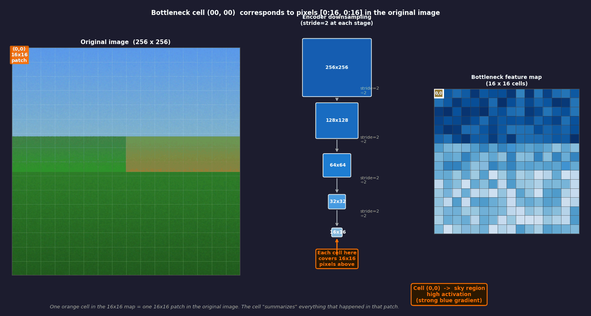
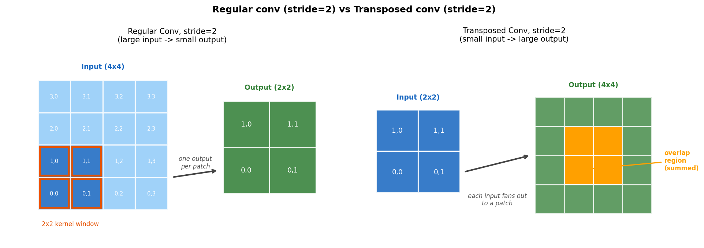
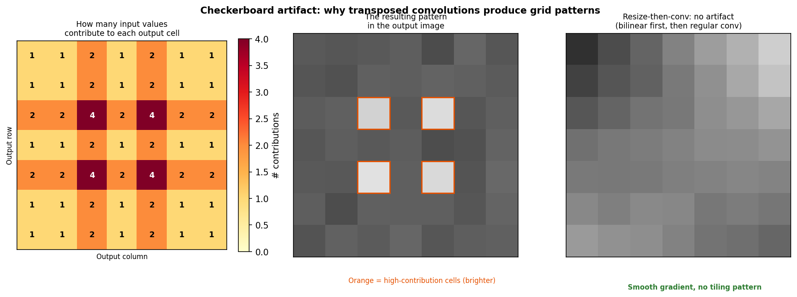
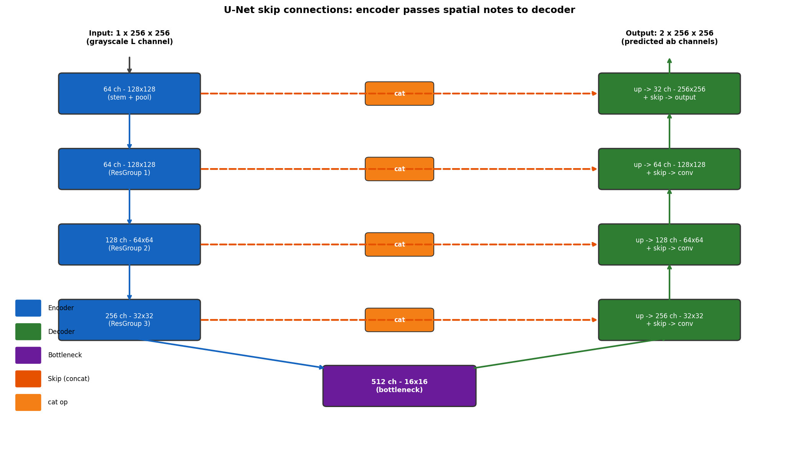
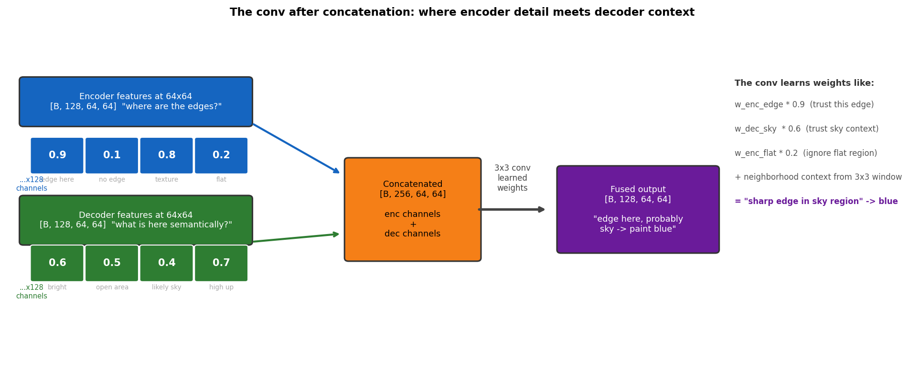
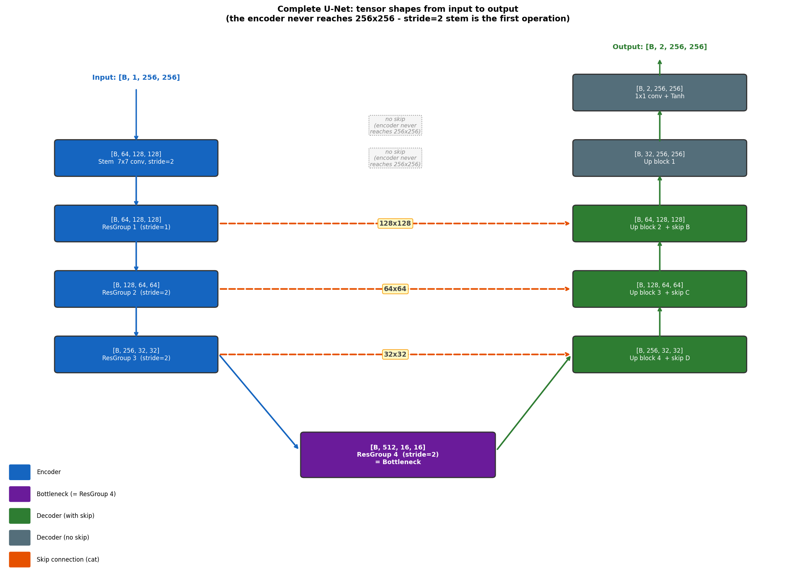

# Chapter 5: U-Net - The Network with Memory

> *"The encoder looks at the entire image, compresses everything it understood into a small blob, and hands it to the decoder. The decoder then has to reconstruct the full image from that blob. Nobody told the decoder it would also need to remember where exactly the cat's ear was. This is why we have skip connections."*

Chapter 4 introduced U-Net as a sketch: encoder compresses, decoder expands, skip connections bridge them. This chapter is the full story, including the parts that are less tidy in practice.

---

## 5.1 The Tension at the Heart of Colorization

Classification networks have it easy. Their job is to turn an entire image into a single label: "cat," "truck," "pizza." Compression is not a side effect, it is the goal. By the time the signal reaches the final layer, every spatial detail has been deliberately thrown away. One answer per image, done.

Colorization needs one answer *per pixel*. Not "this is a cat" but "this specific pixel, at row 143, column 78, is this specific shade of orange." For 256x256 images that is 65,536 simultaneous answers, each spatially correct.

The problem is that getting the color right requires *understanding*, and understanding requires compression. To know that a patch of pixels is cat fur and should be orange, you need to have seen enough of the image to recognize the cat first. A network looking at one pixel at a time has no idea what it is looking at.

```
What you need to KNOW:    large receptive field, compressed features, semantic understanding
What you need to OUTPUT:  full resolution, spatially precise, one color per pixel

These two requirements pull in opposite directions.
```

The encoder-decoder architecture resolves this by doing both in sequence. First understand, then paint. The skip connections make sure the spatial precision needed for painting survives the understanding phase. It is an elegant solution to a genuinely hard problem, and like most elegant solutions, it looks obvious in retrospect and took years to figure out.

---

## 5.2 The Encoder: Understanding by Forgetting

The encoder is ResNet-18 (Chapter 4), adapted for 1-channel grayscale input. Unlike some U-Net variants, this implementation keeps the standard ResNet-18 stem intact, max-pool included: `fastai.create_body(resnet18, cut=-2)` simply removes the final average-pool and classification head, leaving everything else - conv1, batch-norm, relu, max-pool, and all four residual stages - untouched. That max-pool costs one extra halving of resolution that a hand-built U-Net might have skipped, but it also means the encoder is exactly the ResNet-18 everyone already knows, which keeps the pretrained ImageNet weights meaningful layer-for-layer.

### Stage 1: The 7x7 stem

The first operation is a convolution with a **7x7 kernel, stride=2, 64 output channels**. This is larger than the 3x3 filters used everywhere else, and deliberately so.

At this point the network is looking at raw pixel values. A 3x3 kernel sees only nine pixels - a 9-pixel window into a 256x256 image gives almost no context. A 7x7 kernel sees 49 pixels and has a fighting chance of detecting something useful on the very first pass. After a few layers of 3x3 convolutions the receptive field grows anyway (Chapter 3), but starting wider saves a few layers of warmup.

The stride=2 halves the output resolution:

```
Input:   1 x 256 x 256
         7x7 conv, 64 filters, stride=2
Output:  64 x 128 x 128

Three things at once:
  - 64 different feature maps extracted (one per filter)
  - spatial resolution halved (256 -> 128)
  - raw pixel intensity -> learned features
```

### The full encoder path

Verified directly against the running model (`create_body(resnet18, cut=-2)` followed by a forward pass with hooks on every stage) - not just read off the architecture diagram:

```
Input:    1  x 256 x 256   (grayscale L channel)
   |
   v  7x7 conv, stride=2, 64 ch  (+ BatchNorm + ReLU)
Stem:     64 x 128 x 128              <- skip A
   |
   v  3x3 max-pool, stride=2
        64 x  64 x  64
   |
   v  2 residual blocks, stride=1, 64 ch
Layer 1:  64 x  64 x  64              <- skip B
   |
   v  2 residual blocks, stride=2, 128 ch
Layer 2:  128 x  32 x  32             <- skip C
   |
   v  2 residual blocks, stride=2, 256 ch
Layer 3:  256 x  16 x  16             <- skip D
   |
   v  2 residual blocks, stride=2, 512 ch
Layer 4 / Bottleneck: 512 x 8 x 8
```

That is one more halving than a maxpool-free encoder would give: the max-pool between the stem and Layer 1 is standard, unmodified ResNet-18, and it is what pulls the bottleneck down to 8x8 rather than 16x16.

### What 512 x 8 x 8 actually means

The bottleneck has 64 spatial cells (8 rows x 8 columns). Each cell corresponds to one 32x32 patch of the original image (256 / 8 = 32) - the animation shows this. But there are 512 of these grids stacked on top of each other, one per channel.

Each channel is one filter that learned to detect something specific during training. One fires for sky. Another for grass. Another for animal fur texture. Another for hard edges between regions. At any spatial cell, 512 numbers are stacked up, each answering a different question about that 32x32 patch:

```
Cell (row=3, col=7) - covers top-right area of the image:
  channel 0:   0.92   (strong sky signal)
  channel 1:   0.04   (no grass here)
  channel 2:   0.77   (bright gradient, consistent with open sky)
  channel 3:   0.11   (no animal texture)
  ...
  channel 511: 0.58   (possible cloud boundary)
```

512 channels = 512 different semantic questions answered for that patch. The total value count went up compared to the input (512 x 8 x 8 = 32,768 vs 65,536 input pixels - roughly half, not the 2x the 16x16 version would have suggested), but that misses the point. The compression is in *meaning*. Each of the 64 spatial cells carries a 512-dimensional description of what is happening in its 32x32 patch. Not "this pixel is brightness 173" but "this patch is open sky, near the horizon, some gradient from top to bottom." That is what the decoder uses to decide colors.



*Left: the original image with the active patch in orange. Center: how stride=2 at each stage (stem, max-pool, and three residual layers) brings 256x256 down to 8x8. Right: the 8x8 bottleneck - the active cell highlighted. Moving one cell in the bottleneck jumps 32 pixels in the original image.*

As spatial dimensions shrink, exact positions are lost. The network knows there is a cat somewhere in the upper-left quadrant. It does not know whether the ear tip was at column 87 or column 91. That precision disappears in the downsampling. This is the cost of understanding - you cannot hold a magnifying glass to every pixel while also appreciating the whole scene. The decoder has to recover it somehow, and the skip connections are how.

---

## 5.3 The Decoder: Painting What You Understood

The decoder runs the encoder in reverse. Spatial dimensions grow back up; channel count shrinks back down. At the end, it produces 2 x 256 x 256: two color channels (a and b in LAB space) at full resolution.

The core operation is **upsampling**: making a small feature map bigger. Three options exist.

### Method 1: Bilinear Interpolation

The same as zooming in on a photo in an image editor. For a 16x16 grid going to 32x32, each new point is a weighted average of the four nearest original points, based on distance.

```
Original (2x2):           Upsampled 2x (4x4):
┌────┬────┐               ┌────┬────┬────┬────┐
│ A  │ B  │               │  A │ AB │ AB │  B │
├────┼────┤               ├────┼────┼────┼────┤
│ C  │ D  │    -->        │ AC │ABCD│ABCD│ BD │
└────┴────┘               ├────┼────┼────┼────┤
                          │ AC │ABCD│ABCD│ BD │
                          ├────┼────┼────┼────┤
                          │  C │ CD │ CD │  D │
                          └────┴────┴────┴────┘
```

No learnable parameters. Smooth but blurry. Usually paired with a regular conv afterward.

### Method 2: Transposed Convolution

A regular conv with stride=2 collapses a 2x2 region into one value. A **transposed convolution** does the reverse: one value fans out to cover a patch in the output.



*Left: regular conv. One patch becomes one value. Right: transposed conv. One value fans out to a patch. Overlap regions are summed.*

Learnable weights make this more expressive than bilinear interpolation. The problem is **checkerboard artifacts** - the output looks like it was colorized by someone who was also laying bathroom tile at the time.

### Why checkerboard artifacts happen

With stride=2 and a 3x3 kernel, each input value places its 3x3 fan-out patch two steps from its neighbor's. Three wide, two apart: adjacent patches overlap by one row or column. Some output cells receive contributions from four input values; others from one. With non-symmetric kernel weights, the "heavy" cells become systematically brighter or darker, forming a regular tiled pattern across the output.



*Top: number of input values contributing to each output cell. Middle: with non-symmetric kernel weights, high-contribution cells become systematically brighter. Bottom: the resulting grid pattern visible in the output.*

### Method 3: Resize then Convolve

Bilinear upsample first (no parameters, no artifacts), then a regular conv to learn the refinement:

```python
nn.Sequential(
    nn.Upsample(scale_factor=2, mode='bilinear', align_corners=True),
    nn.Conv2d(in_channels, out_channels, kernel_size=3, padding=1),
    nn.BatchNorm2d(out_channels),
    nn.ReLU(inplace=True)
)
```

"Make it bigger" is fixed. "Make it good" is learned. No artifacts. This is a common, simple choice, but it is not what the decoder in this project actually uses.

### Method 4: PixelShuffle with ICNR init (what we actually use)

The generator is built with fastai's `DynamicUnet`, and its decoder blocks use **`PixelShuffle_ICNR`**, not a hand-written resize-then-conv block. The idea is a bit different from all three methods above:

1. A 1x1 convolution expands the channel count by `scale^2` (for a 2x upsample, that is 4x the channels) *without* changing spatial size.
2. `nn.PixelShuffle(scale)` rearranges those extra channels into extra spatial positions: a `[B, C*4, H, W]` tensor becomes `[B, C, 2H, 2W]`. No interpolation, no fan-out overlap - every output pixel comes from exactly one of the input's (rearranged) values.
3. The 1x1 conv's weights are **ICNR-initialized** ("initialized to convolution NN resize"): at the start of training, the conv is set up so that the pixel-shuffle result is equivalent to nearest-neighbor upsampling. Training then refines those weights. This specific initialization exists because plain PixelShuffle, trained from a random init, produces the same checkerboard artifacts as transposed convolution - ICNR is the fix.

```python
# conceptually, fastai's PixelShuffle_ICNR(ni, nf, scale=2)
nn.Sequential(
    ConvLayer(ni, nf * scale**2, ks=1),   # 1x1 conv, ICNR-initialized
    nn.PixelShuffle(scale),               # channels -> spatial resolution
)
```

So: no bilinear blur, no transposed-conv fan-out, and (with the default settings used here) no extra blur/anti-aliasing pooling step either. Checkerboard artifacts are avoided by initialization, not by avoiding learned upsampling altogether.

The hand-rolled `ClassicUnet` class also present in this repository (`src/models/generator.py`, used only when `USE_RESNET=False`) *does* use plain transposed convolutions, for comparison - it is not the path used to produce any of the reported results.

---

## 5.4 Skip Connections and What Happens After Concatenation

Without skip connections, the decoder only has the bottleneck. It expands blindly, inventing edge positions from context alone. Colors end up roughly in the right regions but boundaries are soft and smeared - the colorization equivalent of painting with oven mitts. The model knows there is a tree. It just does not know exactly where the tree ends and the sky begins. Skip connections are the answer to that problem.

U-Net's skip connections give the decoder direct access to the encoder's intermediate feature maps at each scale.



The key operation is **concatenation along the channel dimension**:

```
Encoder skip at 64x64:   [batch, 128, 64, 64]
Decoder features at 64x64:  [batch, 128, 64, 64]
After concatenation:         [batch, 256, 64, 64]
After conv block:            [batch, 128, 64, 64]
```

### What each side actually carries

The **encoder skip** at 64x64 was computed early in the forward pass, before the signal reached the bottleneck. It carries precise spatial information: exactly where edges are, where textures change, where one region ends and another begins. It does not have much semantic understanding yet. It knows *where* things are, but not necessarily *what* they are.

The **decoder features** at 64x64 came from the bottleneck flowing back up. The bottleneck saw the whole image and processed it semantically. By the time that signal reaches the 64x64 level, the decoder features carry semantic context: "this region is sky," "this region is grass." They have the big picture. What they lost is spatial precision - the bottleneck squeezed out the exact edge positions.

```
Encoder skip:      WHERE things are. Precise edge and texture positions.
                   Semantics: limited.

Decoder features:  WHAT things are. Semantic context from the bottleneck.
                   Spatial precision: reduced.
```

The convolution after concatenation merges both. It can learn: "the encoder says there is a sharp edge at this exact pixel, and the decoder says this is sky meeting tree canopy - therefore color left sky-blue and right dark green."

### The conv after concatenation with concrete numbers

At one spatial position at the 64x64 level:

```
Encoder skip features (4 channels shown, 128 in practice):
  e = [0.9,  0.1,  0.8,  0.2]
      "sharp edge here, no flat zone, strong boundary, no curve"

Decoder features (4 channels, from bottleneck flowing back):
  d = [0.6,  0.8,  0.1,  0.7]
      "sky-type region, high confidence, not grass, open area"

After concatenation:
  combined = [0.9, 0.1, 0.8, 0.2,  0.6, 0.8, 0.1, 0.7]
              ^-- encoder: WHERE --^   ^-- decoder: WHAT --^

3x3 conv output for one channel:
  out = w0*0.9 + w1*0.1 + w2*0.8 + w3*0.2
      + w4*0.6 + w5*0.8 + w6*0.1 + w7*0.7
      + (contributions from 8 neighboring positions in the 3x3 window)
  = a value encoding "sharp edge in a sky region"
```

The weights w are learned from training. The network sees thousands of examples where certain combinations led to good color predictions and adjusts accordingly.



*Encoder features (blue): WHERE. Decoder features (green): WHAT. The conv after cat merges both.*

---

## 5.5 Architecture: Full Dimension Walk-Through

One thing to establish first: **the encoder never produces a 256x256 feature map.** The very first operation is a stride=2 convolution, halving the input to 128x128 immediately. There is no *encoder* skip connection at the 256x256 level - though, as the last row below shows, the decoder does get one more piece of help at that resolution, straight from the raw input.

The table below was captured by hooking every layer of the real model (`DynamicUnet(create_body(resnet18, cut=-2), 2, (256,256))`) and printing the tensor shape after each one - it is not derived from the architecture description, it is what the model actually does:

```
INPUT
  L channel:      [B,   1, 256, 256]

ENCODER
  Stem (7x7 s2):  [B,  64, 128, 128]      <- skip A
  MaxPool (s2):   [B,  64,  64,  64]
  Layer 1:        [B,  64,  64,  64]      <- skip B
  Layer 2:        [B, 128,  32,  32]      <- skip C
  Layer 3:        [B, 256,  16,  16]      <- skip D
  Layer 4:        [B, 512,   8,   8]      <- BOTTLENECK

MIDDLE (bridge convs, resolution unchanged)
                  [B, 512,   8,   8]

DECODER (each block: PixelShuffle_ICNR upsample, then concat skip, then conv)
  Up block 4:     upsample -> [B, 256,  16,  16]
                  cat skip D -> conv -> [B, 512,  16,  16]

  Up block 3:     upsample -> [B, 256,  32,  32]
                  cat skip C -> conv -> [B, 384,  32,  32]

  Up block 2:     upsample -> [B, 192,  64,  64]
                  cat skip B -> conv -> [B, 256,  64,  64]

  Up block 1:     upsample -> [B, 128, 128, 128]
                  cat skip A -> conv -> [B,  96, 128, 128]

  Final upsample: PixelShuffle_ICNR -> [B,  96, 256, 256]
                  (no encoder skip at this resolution - it never existed)
                  cat raw input L    -> [B,  97, 256, 256]
                  ResBlock + 1x1 conv -> [B,   2, 256, 256]

OUTPUT
  ab channels:    [B,   2, 256, 256]
```



*Encoder arm: spatial resolution shrinks, channels grow, four skip levels (128, 64, 32, 16) plus an 8x8 bottleneck. Decoder arm: PixelShuffle_ICNR upsampling at every step, mirroring the encoder back up. At full resolution there is no encoder skip to draw on, but fastai's `DynamicUnet` concatenates the original 1-channel input directly before the final refinement block - a direct, if narrow, path from input to output.*

With a 256x256 input and stride=2 at every downsampling step, all spatial dimensions divide evenly and the encoder-decoder pairs match exactly. The off-by-one size mismatch problem that plagues U-Net implementations only appears with odd-dimension inputs.

---

## 5.6 How the Network Learns What Color to Use

The pretrained ImageNet encoder can recognize that a region is grass. Some channel lights up reliably for grass textures. But "this is grass" does not automatically produce a color. The encoder never saw color during colorization training - it received grayscale. It knows what grass *looks like in grayscale*, not what color it is.

The decoder learns the color association from the loss function during training:

```
Training step 1, on a photo of a green meadow:
  Encoder: strong grass-texture activations
  Decoder: random initial guess: a=+50, b=+60  (warm orange - wrong)
  Ground truth: a=-30, b=+25  (grass green)
  L1 loss is large. Backprop fires.
  Decoder weights shift: "when encoder signals grass, push a and b toward (-30, +25)"

After 50,000 steps across thousands of grass photos:
  Decoder has learned: encoder grass pattern -> a in [-25,-40], b in [+25,+35]
  It does not know the word green.
  It learned a statistical association between encoder activations and LAB values
  that happens to correspond to what humans call green.
```

The GAN discriminator adds a second pressure on top of this. If the decoder predicts a pale, desaturated green, the discriminator flags it as fake. The generator gets penalized and learns to commit to something more vivid. Chapter 7 covers this in detail.

The ImageNet pretraining and the training loss work together. The pretrained encoder arrives on day one already recognizing grass, sky, and skin. Without it, the encoder would spend most of the training budget just learning to see, leaving almost nothing for the decoder to learn colors from. With it, the decoder gets meaningful supervision from a working encoder immediately, and learns the color associations much faster.

---

## 5.7 Transfer Learning in Practice

```
Without pretrained weights:   epoch  1  ->  random color noise
                              epoch  5  ->  blotchy regions, no structure
                              epoch 50  ->  something recognizable, maybe

With pretrained weights:      epoch  1  ->  plausible colors, rough boundaries
                              epoch  5  ->  good global color, reasonable edges
                              epoch 50  ->  sharp, spatially correct colorization
```

The one adaptation required: the first convolutional layer expects 3-channel RGB, but ours takes 1-channel grayscale:

```python
old_weight = model.conv1.weight.data              # [64, 3, 7, 7]
new_weight = old_weight.mean(dim=1, keepdim=True)  # [64, 1, 7, 7]
model.conv1 = nn.Conv2d(1, 64, kernel_size=7, stride=2, padding=3, bias=False)
model.conv1.weight.data = new_weight
```

Averaging the three RGB channel weights is a reasonable approximation. A filter sensitive to bright red, green, and blue becomes sensitive to bright intensity overall - which is what the L channel represents.

The decoder is initialized randomly. The encoder brings expertise; the decoder learns from scratch on top of it. Think of it as hiring an experienced biologist to describe what is in the image, and then asking a fresh graduate student to do the coloring based on those descriptions. The biologist knew what they were doing on day one. The graduate student listened, made mistakes, and eventually got very good at it.

---

## Glossary

| Term | What it means |
|------|---------------|
| **Pixel-wise prediction** | One output value per input pixel. Colorization, segmentation, depth estimation are all pixel-wise. The opposite of classification, which outputs one label per image. |
| **Bottleneck** | The lowest-resolution point. 512 channels at 8x8 = 512 semantic questions answered for each of 64 image patches (32x32 pixels each). |
| **7x7 stem conv** | First convolution in ResNet-18. Larger kernel for more context on raw pixels. Stride=2 halves spatial size immediately. The standard ResNet-18 max-pool right after it is kept, not removed. |
| **Bilinear interpolation** | Upsampling by weighted-averaging neighbors. Smooth, no parameters, no artifacts. Not used in this project's decoder. |
| **Transposed convolution** | Learned upsampling. Each input value fans out to a patch in the output. More expressive than bilinear, but produces checkerboard artifacts. Used by the alternative `ClassicUnet`, not by the ResNet-18 decoder actually used to produce the reported results. |
| **Checkerboard artifact** | Regular grid pattern in upsampled outputs. Caused by uneven contribution counts (transposed conv) or an unfavorable random init (plain PixelShuffle) combined with non-symmetric weights. |
| **Resize-then-conv** | Bilinear upsample (fixed), then regular conv (learned). No artifacts. A reasonable alternative design, but not what this project's decoder uses. |
| **PixelShuffle_ICNR** | The upsampling method this project's decoder actually uses: a 1x1 conv expands channels by scale^2, then `PixelShuffle` rearranges those channels into extra spatial resolution. ICNR initialization starts the conv equivalent to nearest-neighbor resize, which avoids checkerboard artifacts from the first training step onward. |
| **Encoder skip features** | Feature maps saved at each encoder scale. Carry spatial precision: exact edge and boundary positions. Less semantic than the bottleneck. |
| **Decoder features** | Features flowing back up from the bottleneck. Carry semantic context from having processed the whole image. Less spatially precise. |
| **Conv after cat** | Convolution following concatenation. Merges encoder spatial precision with decoder semantic context. |
| **Transfer learning** | Starting from weights pretrained on a larger dataset. The encoder arrives already knowing what grass, sky, and skin look like. The decoder still starts from scratch. |
| **Statistical association** | What the decoder actually learns: when the encoder produces activations like X, output LAB values like Y. No understanding of color in a human sense, just pattern matching at scale. |

*Continue to [Chapter 6: Color Space - Why Not RGB?](chapter_06_colors.md)*
