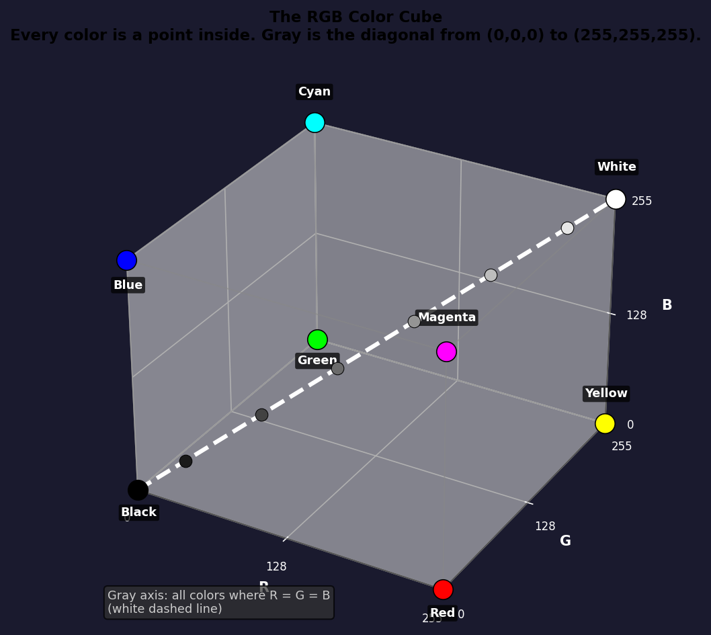
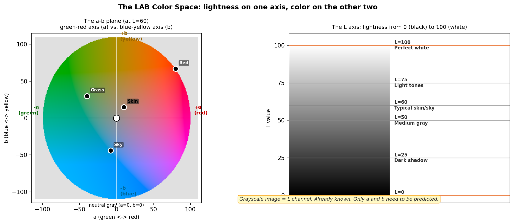
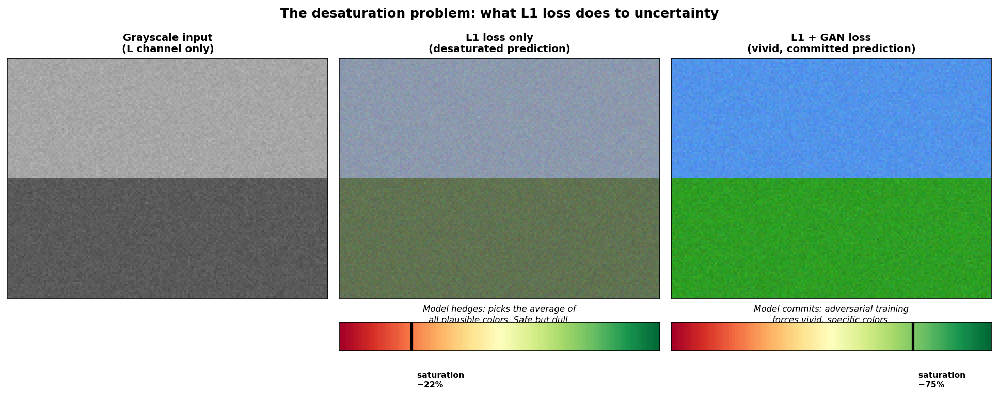

# Chapter 6: Color Space - Why Not RGB?

> *"RGB is a lie we tell computers. It is convenient for monitors, bewildering for math, and a terrible basis for teaching a model what color means. LAB, by contrast, was designed by humans who actually thought about color first and monitors second."*

Before you can teach a network to colorize an image, you have to decide what "color" even means as a mathematical object. The answer is not obvious. Color is a perception, not a physical measurement, and the way you represent it matters enormously.

---

## 6.1 How Computers Usually Represent Color

The standard representation is **RGB**: three channels, each an integer from 0 to 255, representing the intensity of red, green, and blue light. Every pixel on your screen emits some combination of those three and your eye blends them into a color.

```
Red:   (255,   0,   0)   -> bright red
Green: (  0, 255,   0)   -> bright green
Blue:  (  0,   0, 255)   -> bright blue
White: (255, 255, 255)   -> all three at max
Black: (  0,   0,   0)   -> none of them
Gray:  (128, 128, 128)   -> all three equal, half intensity
```



*The RGB cube. Each axis represents one channel. Every representable color is a point inside this cube. The gray diagonal runs from black (origin) to white (far corner). Notice that grayscale pixels form a line, not a plane - all three channels are equal.*

RGB is great for displaying colors. It is not great for reasoning about them.

---

## 6.2 The Problem with RGB for Colorization

If you tried to train a colorization model with RGB input and RGB output, you would face several problems at once.

**Problem 1: you already know one thing and RGB hides it.**

A grayscale image contains the luminance of each pixel - roughly, how light or dark it is. In RGB, luminance is encoded implicitly. A pixel with R=G=B=128 is gray with medium brightness. But a pixel with R=220, G=30, B=30 is bright red with roughly the same luminance. Luminance is buried inside the three channels and there is no clean way to extract it.

This means your model would have to first reverse-engineer what it already knows (luminance) from the input, and then predict three correlated values from it. You are asking the model to do extra work for no reason.

**Problem 2: the three channels are highly correlated.**

Most pixels in the world are not pure red, pure green, or pure blue. They are some mixture. Grass that is G=180 probably has R=80 and B=60 as well - the channels are not independent. The model has to learn these correlations from scratch. The loss function has to penalize disagreements between three channels simultaneously.

**Problem 3: "wrong" in RGB is not "wrong" in perception.**

A pixel predicted as (200, 50, 50) when the truth is (190, 55, 55) might be a small perceptual difference. A pixel predicted as (50, 200, 50) when the truth is (200, 50, 50) - same L1 distance from the wrong point - is a completely wrong hue. RGB does not distinguish between these cases.

---

## 6.3 How Human Vision Actually Works

The human eye has three types of cone cells: S, M, and L (short, medium, and long wavelength). But the visual cortex does not process raw cone signals. It converts them into two different signals almost immediately:

- One signal for **lightness** (roughly luminance: how bright the thing is)
- Two signals for **chrominance** (roughly hue and saturation: what color it is)

This is not a coincidence. It is an evolutionary adaptation. Lightness perception is much more important for survival (is that shadow a predator? how rough is that terrain?) than precise color perception. Your eye has about 120 million rod cells for luminance and 6 million cone cells for color. You are twenty times better at seeing brightness differences than color differences.

JPEG compression exploits this shamelessly. It stores luminance at full resolution and chrominance at half resolution (a system called 4:2:0 chroma subsampling). The resulting images look fine to humans because our color resolution is genuinely limited. You have been viewing compressed color information your entire life and not noticing. You have also been breathing mostly nitrogen your entire life and not noticing. Some facts only matter when they become useful.

For colorization, this perceptual structure is useful. The input - the grayscale image - contains exactly the high-precision, perceptually important information: luminance. The thing we need to predict - color - is the lower-precision component. The problem is asymmetric in a way that RGB cannot express, but LAB can.

---

## 6.4 The LAB Color Space

**LAB** (also written L\*a\*b\*, or CIELAB) was standardized by the International Commission on Illumination (CIE) in 1976. It was designed with one goal: make the numerical distance between two colors reflect the *perceptual* difference a human observer would notice. It turns out that if you want to do math on colors, you should use a color space designed by people who were thinking about math on colors. Obvious in retrospect.

It has three channels:

```
L:  Lightness.  Range 0 to 100.
    L=0 is perfect black. L=100 is perfect white.
    L=50 is medium gray.
    This is the grayscale channel.

a:  Green to Red axis.  Range roughly -128 to +127.
    Negative a: greenish
    Positive a: reddish/magenta
    a=0: neither green nor red

b:  Blue to Yellow axis.  Range roughly -128 to +127.
    Negative b: bluish
    Positive b: yellowish
    b=0: neither blue nor yellow
```



*The LAB gamut. The vertical axis is L (lightness). At any given L level, the a-b plane is a roughly circular region of reachable colors. Not all (a, b) combinations are valid at every L - very dark colors cannot be saturated yellows, for instance. The neutral gray axis is where a=0 and b=0.*

The key property: **equal distances in LAB space correspond to roughly equal perceptual differences.** Move 10 units in any direction and a human observer will judge the color change as roughly the same size, regardless of where in the space you started. RGB has no such property - a change of 10 in the blue channel near gray looks different from the same change near yellow.

What does "perceptual difference" mean concretely? Take two experiments in RGB:

```
Experiment 1: shift blue by 50
  Pixel A: (128, 128, 128) -> medium gray
  Pixel B: (128, 128, 178) -> faint purplish-gray
  Verdict: barely noticeable

Experiment 2: shift blue by 50, starting from a warm color
  Pixel C: (200, 150,  50) -> warm orange-brown
  Pixel D: (200, 150, 100) -> muddy brownish
  Verdict: quite noticeable color shift, different character from Exp. 1

Same numerical shift (50 in the B channel), but one looks almost identical and
the other looks meaningfully different. RGB distance does not track perception.
```

In LAB, the same numerical distance (say, 10 units) produces the same amount of perceived difference regardless of where you are in the space. Shift a sky-blue color by 10 LAB units, or shift a dark-shadow color by 10 LAB units - a human observer rates both changes as equally large. This is what "perceptually uniform" means in practice.

The standard metric for this is **Delta-E**: two colors with Delta-E below 1 are imperceptible to most people; above 3 they are noticeable; above 10 they look clearly wrong. Delta-E is defined directly in LAB space, which is why LAB is the standard for color-critical applications (printing, textile, display calibration).

---

## 6.5 Why LAB is Perfect for Colorization

The match between LAB and the colorization problem is almost too good.

**The L channel is exactly the grayscale input.** A grayscale image is, by definition, luminance information only. In LAB, that is L. To convert a grayscale image to LAB, you have L already - the grayscale values - and you need to predict a and b.

```
Grayscale image  ->  L channel (you have this, no prediction needed)
                 ->  a channel (predict this)
                 ->  b channel (predict this)
```

You go from predicting three correlated values (R, G, B) to predicting two nearly independent values (a, b). The task becomes simpler by construction.

**The a and b channels are more independent than R, G, B.** Grass being green means high negative a (greenish) and slightly positive b (yellowish). The sky being blue means slightly positive a and strongly negative b. Sky and grass rarely appear at the same pixel, so predicting a and b together is less ambiguous than predicting R, G, B together.

**The loss function becomes meaningful.** L1 loss on (a, b) penalizes perceptually wrong colors proportionally, because LAB is perceptually uniform. Getting the sky wrong by 20 LAB units is roughly the same severity whether the sky is dark or light.

**You can evaluate results in LAB.** Metrics like Delta-E - the perceptual color difference between two colors - are defined directly in LAB space. They can be computed analytically without any special preprocessing.

---

## 6.6 Converting to LAB in Practice

PyTorch does not include a built-in LAB conversion. The conversion goes through an intermediate step:

```
RGB  ->  XYZ  ->  LAB
```

XYZ is another CIE color space that we do not need to understand in detail - it is just a linear transformation of RGB. The conversion from XYZ to LAB is non-linear (it involves cube roots), which is why it is a two-step process.

In our code, the conversion happens on the CPU, per image, using `scikit-image`:

```python
# from src/data/dataset.py
from skimage.color import rgb2lab

img = Image.open(path).convert("RGB")
img = np.array(img)                       # [H, W, 3], uint8

img_lab = rgb2lab(img).astype("float32")  # [H, W, 3], L in [0,100], a/b roughly [-128, 127]
img_lab = transforms.ToTensor()(img_lab)  # -> [3, H, W]

L  = img_lab[[0], ...]   # [1, H, W]
ab = img_lab[[1, 2], ...]  # [2, H, W]
```

For the grayscale input to the generator, we use L directly. For the training target, we use ab. This happens inside `ColorizationDataset.__getitem__`, once per image, before batching - not as a batched GPU op.

---

## 6.7 Normalization: Getting to [-1, 1]

Neural networks work best with inputs and outputs in a consistent, bounded range. Raw LAB values are not in that range: L goes up to 100, and a/b go up to roughly 128. We normalize everything to [-1, 1]:

```python
# Normalize L to [-1, 1]: divide by 50, subtract 1
L_norm = (L / 50.0) - 1.0         # [0, 100] -> [-1, 1]

# Normalize ab to [-1, 1]: divide by 110 (a safe bound)
ab_norm = ab / 110.0               # [-110, 110] -> [-1, 1]
```

The generator takes L_norm as input and outputs ab_norm in [-1, 1] (enforced by Tanh). To produce the final colored image, we reverse:

```python
ab_pred = model(L_norm)            # [-1, 1]
ab_actual = ab_pred * 110.0        # back to LAB units
L_actual = (L_norm + 1.0) * 50.0  # back to LAB units

lab_image = torch.cat([L_actual, ab_actual], dim=1)
rgb_image = KC.lab_to_rgb(lab_image)
```

The reconstruction is lossless - no information is destroyed by normalizing and denormalizing with exact inverses.

---

## 6.8 The Desaturation Problem

Here is something that will become relevant in the next chapter.

If a model trained with L1 loss is uncertain about the color of a region, the safest prediction is **a=0, b=0**: neutral gray. No color at all. This minimizes the expected L1 loss when the true color could be any of several plausible options.

```
Suppose grass could be:  a=-30, b=30    (fresh green)
                         a=-20, b=20    (dry green)
                         a=-10, b=10    (very dry, yellowish)

Average prediction:      a=-20, b=20    (dry green) - acceptable loss
                         a=0,   b=0     (gray)       - equally bad for each option

In practice, the model often drifts toward desaturated predictions
because they are "safe" - never catastrophically wrong.
```

This is not a bug in the model. It is a rational response to an ambiguous task with an L1 loss. The model learned that "gray is never completely wrong, so when in doubt, go gray." And it never forgot.

The result is colorizations that look washed out: everything is technically tinted but nothing pops. Grass is pale, sky is light blue, skin is whitish. Correct but unconvincing. The model has solved the problem as stated. It has not solved the problem you actually wanted.

The fix is to tell the model that "being confidently wrong is better than being timidly right." This is the job of the **adversarial loss**, which is the story of Chapter 7.



*Left: L1 loss only. Colors are present but washed out - the model hedged everywhere. Right: GAN training included. Colors are vivid and committed. The model had to pick a specific color and defend it.*

---

## 6.9 A Brief Tour of What a and b Values Mean

It helps to have a feel for what (a, b) values correspond to in the real world.

```
Color            L     a      b
-----------    ----  -----  -----
Bright red       53    +80    +67
Bright green     88    -86    +83
Sky blue         60    -8     -44
Pale skin        70    +10    +15
Dark skin        35    +5     +10
Dry grass        60    -20    +35
Fresh grass      45    -40    +30
Ocean water      45    -5     -30
Sandy beach      75    -5     +30
White clouds     94    -2     +4
Dark storm sky   25    -3     -15
```

A few observations. Red and green have large magnitude a values - that is literally the axis they live on. Sky and ocean are distinguished by b (blue). Skin across different tones mostly varies in L (lightness) with relatively small changes in a and b. This is useful: it means the model can learn "this texture is human skin" and apply a small offset in (a, b) while L handles the tonal variation automatically.

Also notice that very saturated colors (bright red, green) live far from the center of the ab plane. Most of the world - wood, concrete, fabric, soil - is clustered in a smaller region near the center. The model sees a lot of near-gray training examples and relatively few vivid ones, which is part of why it tends to predict neutral colors unless pushed.

---

## Glossary

| Term | What it means |
|------|---------------|
| **RGB** | Red, Green, Blue. The standard display color space. Three channels, values 0-255. Convenient for screens, not for color math. |
| **Luminance** | A measure of perceived brightness, weighted by human visual sensitivity. Roughly the average of R, G, B with a perceptual weighting. |
| **Chrominance** | The color component of a signal after luminance has been separated out. In LAB, this is the a and b channels. |
| **LAB (CIELAB)** | A perceptually uniform color space with L (lightness), a (green-red), and b (blue-yellow) channels. Designed so equal distance = equal perceived difference. |
| **Perceptually uniform** | A property of a color space where equal numerical distances correspond to equal perceived color differences. LAB is perceptually uniform; RGB is not. |
| **XYZ** | An intermediate linear color space used to convert between RGB and LAB. You usually do not interact with it directly. |
| **Chroma subsampling** | JPEG's trick of storing chrominance at lower resolution than luminance, exploiting the human eye's lower resolution for color. |
| **Delta-E** | A metric for the perceived difference between two colors, defined in LAB space. Values below 1 are imperceptible; values above 3 are noticeable to trained observers. |
| **Desaturation** | A model's tendency to predict near-gray colors when uncertain. Minimizes L1 loss in expectation but produces washed-out results. Addressed by adversarial training. |
| **Gamut** | The set of colors that can be represented in a given color space. Not all (a, b) combinations are valid at every L level - the gamut is bounded. |

*Continue to [Chapter 7: GANs - The Greatest Duel in AI](chapter_07_gan.md)*
