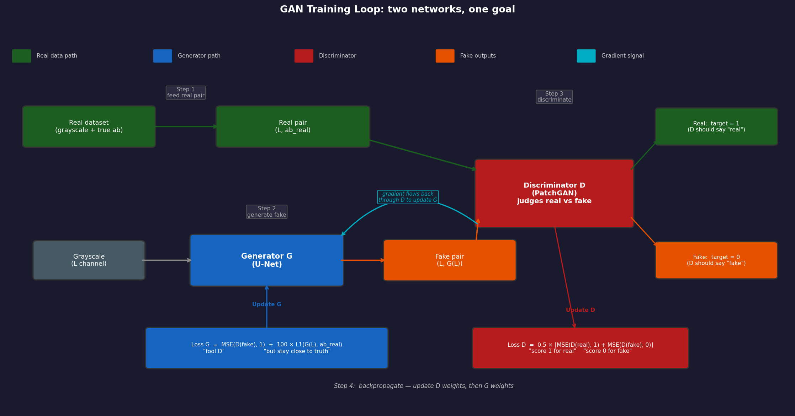
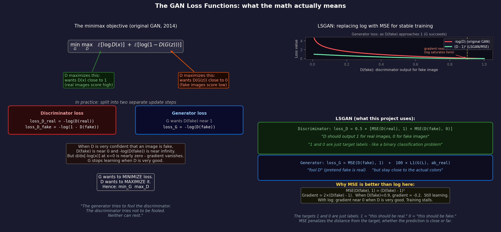
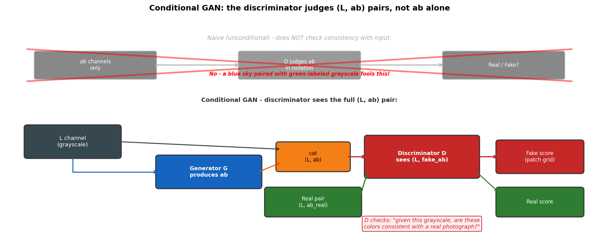
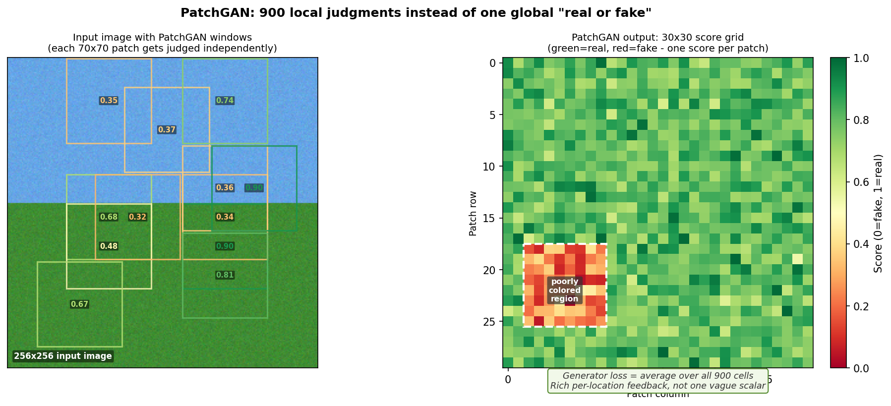

# Chapter 7: GANs - The Greatest Duel in AI

> *"Ian Goodfellow claims he came up with GANs in one night at a bar after a friend challenged him. He went home, implemented it, and it worked on the first try. This is the most implausible origin story in machine learning, and it is completely true."*

At the end of Chapter 6 we established a problem: a model trained with L1 loss alone will produce washed-out, desaturated colorizations. It hedges. It plays safe. It picks the statistical average when it is uncertain, and the average of several plausible colors is often a dull gray-beige.

To fix this, you need to change what the model is being optimized for. Instead of "minimize the average error," try: "produce outputs that a trained critic cannot distinguish from real photographs." This is the GAN idea.

---

## 7.1 The Multi-Modal Colorization Problem

Before we talk about the solution, let us be precise about the problem.

A grayscale image does not uniquely determine one correct coloring. Many colorizations are equally valid.

```
A red fire hydrant and a yellow fire hydrant look identical in grayscale.
An apple can be red, green, or yellow.
A car can be any color at all.
A body of water can be ocean blue, murky green, or rust red.
```

This is called **multi-modality**: there are multiple valid answers ("modes"), not one. An L1 loss sees multiple valid answers and produces their average. The average of red and green is an olive brown. The average of blue and yellow is gray. These averages are not themselves valid colorizations - they are impossible colors that appear nowhere in the training data, and they look wrong to any human viewer.

```
Three valid colorizations of "a parrot":
  Mode 1: [bright red body,    yellow beak]
  Mode 2: [bright green body,  yellow beak]
  Mode 3: [blue-purple body,   orange beak]

L1 average:
  [(red+green+blue-purple)/3 body,  (yellow+yellow+orange)/3 beak]
  = [muddy gray-brown body,          yellowish beak]

This is not a parrot. This is a mistake.
```

The fix is to stop rewarding the average and start rewarding commitment. The model should pick one plausible colorization and defend it vigorously, rather than blending all possible options into a tepid compromise.

---

## 7.2 The GAN Idea

**Generative Adversarial Networks** (Goodfellow et al., 2014) introduce a second neural network - the **discriminator** - whose job is to distinguish real images from generated ones. The generator and discriminator are trained simultaneously, each trying to defeat the other.

```
Generator G:
  Input:  grayscale image (L channel)
  Output: predicted color channels (ab)
  Goal:   produce colorizations that fool the discriminator

Discriminator D:
  Input:  (L channel, ab channels) - either real pair or generated pair
  Output: a score ("how real does this look?")
  Goal:   correctly identify which pairs are real and which are generated
```

The generator tries to fool the discriminator. The discriminator tries not to be fooled. They play this game simultaneously, and over time:

- D gets better at spotting fakes, so G has to produce more convincing colorizations
- G produces more convincing colorizations, so D has to look more carefully
- Both improve, and the generator eventually produces outputs that are statistically indistinguishable from real photographs

This is the **adversarial training** loop. It is adversarial in the sense of two opponents, not in the sense of anyone being malicious. The analogy people use: a forger (G) trying to pass counterfeit currency, and a detective (D) trying to spot the fakes. The forger improves by learning from the detective's failures; the detective improves by studying the forger's increasingly good attempts. Eventually one of them achieves a kind of mastery. More often, one of them gives up first and you have a failed run. The goal of GAN training is to keep both motivated long enough for something useful to emerge.



*The training loop. Top: a real (grayscale, color) pair from the dataset is fed to D and labeled "real." Bottom: the generator produces a colorization from grayscale, which is fed to D and labeled "fake." D's loss updates D's weights. G's loss - how badly it fooled D - updates G's weights. Repeat.*

---

## 7.3 The Minimax Game

Formally, GANs are trained via a minimax objective. The discriminator maximizes its ability to tell real from fake; the generator minimizes the discriminator's ability to do so.

The original loss (Goodfellow et al.) is:

```
min_G  max_D  E[log D(x)] + E[log(1 - D(G(z)))]
```

Where:
- `x` is a real sample
- `G(z)` is a generated sample
- `D(x)` is the discriminator's probability that x is real
- `E[...]` is expectation over the training data

In plain English: D wants to output high values (close to 1) for real samples and low values (close to 0) for fakes. G wants D to output high values for its fakes too, so the discriminator cannot tell them apart.

For practical training, this gets split into two separate loss terms:

```python
# Discriminator loss: classify real as 1, fake as 0
loss_D_real = -log(D(real))          # D wants this to be high (near 1)
loss_D_fake = -log(1 - D(G(gray)))   # D wants this to be low (near 0)
loss_D = loss_D_real + loss_D_fake

# Generator loss: fool the discriminator into thinking fake is real
loss_G = -log(D(G(gray)))            # G wants D to output high values for its fakes
```

In practice, binary cross-entropy handles the log calculations. But we use a variant called **least squares GAN** (LSGAN) that replaces the log with a squared error. It is more stable, and the reason matters.

The log in the original formulation saturates: when the discriminator is very confident (D(fake) near 0), the gradient of -log(D(fake)) approaches zero. The generator gets almost no signal to learn from. MSE does not have this problem - it keeps providing gradients even when D is very confident.

```python
# LSGAN version (what we use in practice)
loss_D_real = MSE(D(real), ones)    # D should output 1 for real images
loss_D_fake = MSE(D(fake), zeros)   # D should output 0 for fake images
loss_D = (loss_D_real + loss_D_fake) * 0.5

loss_G_adv = MSE(D(fake), ones)     # G wants D to output 1 for its fakes too
```

The `ones` and `zeros` here are just target labels. Think of it as a classification problem: 1 means "this should be classified as real," 0 means "this should be classified as fake." MSE measures how far the discriminator's output is from the target label.



*Left: the original minimax objective and what each term means for D and G. Right: why LSGAN (MSE) replaces the log loss - MSE keeps gradients alive even when D is very confident, preventing training stalls.*

---

## 7.4 Conditioning: Tell the Generator What It is Working With

Standard GANs generate images from random noise (`z`). Colorization is a **conditional** task: the output should be a colorization of *this specific grayscale image*, not just any plausible image.

A **conditional GAN** (cGAN) gives both the generator and discriminator access to the conditioning information - in our case, the grayscale L channel.

```
Generator:      G(L)        -> ab
Discriminator:  D(L, ab)    -> real/fake score
```

The discriminator sees both the L channel and the color channels together. If the color channels are plausible but inconsistent with the grayscale (e.g., the model colored a dog's head yellow but the grayscale clearly shows a dark-coated animal), the discriminator should catch this. It learns to judge: "given this luminance, is this colorization plausible?"

This is a subtler judgment than just "does this look like a realistic photograph." The discriminator becomes a critic of the *consistency* between the grayscale input and the predicted colors.



*In the conditional setup, the discriminator does not just look at the ab channels - it sees the (L, ab) pair together. This forces it to learn conditional realism: not just "do these colors look natural" but "do these colors make sense for this grayscale image."*

---

## 7.5 PatchGAN: Stop Judging the Whole Image

The most natural discriminator design would output one scalar per image: "real" or "fake," probability 0 to 1. This is the simplest possible design.

It is also ineffective for colorization.

A single scalar summarizes the entire image with one number. The gradient signal that flows back to the generator from this scalar is correspondingly vague. The generator receives feedback like "this image was 0.4 real" but no information about *which parts* were convincing and which were not.

**PatchGAN** (Isola et al., "Image-to-Image Translation with Conditional Adversarial Networks," 2017) changes this. Instead of judging the whole image, the discriminator judges overlapping patches of the image independently, producing a *grid* of real/fake scores.

```
Image: 256 x 256

PatchGAN with effective receptive field N=70:
Output grid: 30 x 30 (approximately)

Each of the 30x30 = 900 output values answers the question:
"Is the 70x70 patch at this location real or fake?"
```



*PatchGAN output map. Each cell is the discriminator's judgment for the patch centered at that location. The generator's adversarial loss is the average over all cells. This gives 900 independent training signals instead of one, and forces the generator to be locally realistic everywhere.*

The advantages are significant:

**More training signal.** 900 independent gradients vs. 1. The generator gets much richer feedback about where it is failing.

**Local statistics.** PatchGAN effectively models the distribution of local patch textures. This is exactly what matters for colorization: does this patch of fur have the right color? Does this sky patch look like actual sky? You do not need a global judgment to answer these questions.

**Fewer parameters.** A full-image discriminator needs to process the entire 256x256 at once. PatchGAN operates on smaller patches, uses fully convolutional layers, and runs efficiently.

**Better sharpness.** Because the discriminator penalizes blurry patches as "obviously fake" (real photographs have sharp textures), the generator learns to produce sharper outputs to fool it.

The PatchGAN discriminator is a fully convolutional network that progressively downsamples the input:

```
Input: [B, 4, 256, 256]   (L channel + ab channels concatenated)

Conv(64,  4x4, stride=2)  -> [B,  64, 128, 128]   LeakyReLU
Conv(128, 4x4, stride=2)  -> [B, 128,  64,  64]   BatchNorm, LeakyReLU
Conv(256, 4x4, stride=2)  -> [B, 256,  32,  32]   BatchNorm, LeakyReLU
Conv(512, 4x4, stride=1)  -> [B, 512,  31,  31]   BatchNorm, LeakyReLU
Conv(1,   4x4, stride=1)  -> [B,   1,  30,  30]   (no activation, raw scores)
```

The final [30, 30] grid is the output. Each value's receptive field in the original image covers approximately a 70x70 patch. This is the "N" in PatchGAN. You can tune N by adjusting the number of downsampling steps, but 70 is a good default for 256x256 images.

LeakyReLU with slope 0.2 is used throughout. The discriminator benefits from gradients flowing back even for very negative inputs - "how wrong was this?" is important information and you do not want dead neurons in the critic.

---

## 7.6 The Combined Loss for the Generator

The generator receives two kinds of feedback:

**1. Reconstruction loss (L1):** how far are the predicted colors from the ground truth?

```
loss_G_L1 = mean(|G(L) - ab_real|)
```

This keeps the colorization anchored to reality. Without it, the generator would learn to fool the discriminator by producing vivid, saturated colors in wrong places. A bright orange sky might fool a poorly trained discriminator. The L1 term prevents this by penalizing any deviation from the actual colors, even if those deviations "look realistic."

**2. Adversarial loss (GAN):** how convincingly does the colorization fool the discriminator?

```
loss_G_adv = MSE(D(L, G(L)), ones)   # generator wants D to output 1 (real)
```

This pushes the generator toward vivid, committed colors. Without it, the generator hedges toward gray.

The combined loss:

```
loss_G = loss_G_adv + lambda * loss_G_L1
```

`lambda` is a hyperparameter controlling the tradeoff. In the original pix2pix paper, lambda=100. This means the reconstruction loss is weighted 100x more than the adversarial loss. The GAN component shapes the style (vivid vs. washed-out); the L1 component ensures the content is correct (right colors in right places).

```
Low lambda:   GAN dominates. Colors are vivid but possibly wrong.
              The model might make a dog blue because it looks cool.
High lambda:  L1 dominates. Colors are accurate but desaturated.
              Safe but boring. Back to square one.
Balanced:     The model produces accurate AND vivid colorizations.
              The GAN says "commit to a color." The L1 says "commit to the RIGHT color."
```

---

## 7.7 The Training Loop

GAN training alternates between updating the discriminator and updating the generator. The order matters and the balance is delicate.

```python
for L, ab_real in dataloader:

    # --- Update Discriminator ---
    fake_ab = G(L).detach()    # detach: don't propagate gradients to G yet

    D_real_score = D(L, ab_real)
    D_fake_score = D(L, fake_ab)

    loss_D = (MSE(D_real_score, ones) + MSE(D_fake_score, zeros)) * 0.5

    optimizer_D.zero_grad()
    loss_D.backward()
    optimizer_D.step()

    # --- Update Generator ---
    fake_ab = G(L)             # generate again (not detached this time)

    D_fake_score = D(L, fake_ab)

    loss_G_adv = MSE(D_fake_score, ones)
    loss_G_L1  = L1(fake_ab, ab_real)
    loss_G     = loss_G_adv + LAMBDA * loss_G_L1

    optimizer_G.zero_grad()
    loss_G.backward()
    optimizer_G.step()
```

The `detach()` call in the D update is crucial. When training D, we compute gradients for D's parameters only. If we did not detach the fake sample, gradients would flow through D and then through G - and we would accidentally update G's parameters while trying to update D's. Detaching creates a clean separation.

In our implementation, we also control **update frequency**: the discriminator is updated once per batch, the generator is also updated once per batch. Some implementations update D multiple times per G update to keep D strong, but in practice, for well-conditioned problems like colorization with L1 regularization, once per batch is sufficient.

---

## 7.8 What Can Go Wrong

GAN training has a reputation for instability. This reputation is completely earned. Most of the failure modes have names, which is how you know the field has had time to catalog them.

**Mode collapse.** The generator discovers one output that consistently fools the discriminator and just... produces that output for every input. The generated images look realistic but are all variations of the same thing. The discriminator catches up and penalizes this, but then the generator finds the next mode to collapse to. For colorization specifically, mode collapse is less severe because the L1 loss forces the generator to match specific content.

**Discriminator winning too fast.** If D becomes too good too quickly, it outputs near-zero scores for everything G produces. The gradient flowing back to G is nearly zero (the discriminator is so confident that even large changes to G barely move the score). G stops learning. Fix: use a smaller learning rate for D, or reduce D's capacity.

**Generator winning too fast.** If G immediately learns to produce outputs that fool D, D never learns to be a good critic. G then receives no useful feedback and the colorizations stagnate. Fix: make D train more often, or start with a stronger D.

**Oscillation.** D and G chase each other without converging. G improves, D improves, G improves in response, D improves in response. In some configurations, this cycle never terminates and the losses oscillate without making progress. The field calls this "training instability" and it kept researchers busy for several years. Fix: learning rate schedules, more careful architecture choices.

In practice for colorization, the L1 term in the generator loss is a stabilizer. The generator always has a meaningful gradient from reconstruction error, even when the adversarial gradient is noisy. This makes colorization GAN training significantly more stable than unconditional image generation.

---

## 7.9 Our Setup

*These are the baseline `src/` values this book documents. The final model reported in the thesis (SCCL + colorfulness curriculum + DINOv2 refinement) fine-tunes this recipe further - notably lambda_L1=15 and lr=1e-4 - on top of the same GAN/PatchGAN foundation described here. See the top-level README for the final numbers.*

For this project, the GAN configuration is:

```
Generator G:      ResNet-18 U-Net (Chapter 5)
                  Input: L channel [B, 1, 256, 256]
                  Output: ab channels [B, 2, 256, 256], Tanh
                  Loss: lambda * L1 + GAN adversarial

Discriminator D:  PatchGAN, 70x70 receptive field
                  Input: (L, ab) concatenated [B, 3, 256, 256]
                  Output: score grid [B, 1, 30, 30]
                  Loss: LSGAN (MSE vs. real/fake labels)

lambda:           100 (L1 outweighs GAN for stability)
lr_G:             2e-4
lr_D:             2e-4
beta1:            0.5  (Adam momentum term, lower than default for GAN training)
```

The choice of beta1=0.5 (instead of the usual 0.9) comes from the original pix2pix paper. Standard Adam accumulates momentum aggressively, which can cause the generator to overshoot when D suddenly improves. A lower beta1 means less momentum, more cautious steps, and more stable oscillations between G and D.

Training proceeds in two phases: a longer phase training both G and D, followed by a shorter fine-tuning phase with lower learning rates and additional perceptual loss terms (details in Chapter 10).

---

## Glossary

| Term | What it means |
|------|---------------|
| **GAN** | Generative Adversarial Network. Two networks - a generator and a discriminator - trained simultaneously in a minimax game. |
| **Generator (G)** | The network that produces synthetic outputs. In colorization, it takes a grayscale image and outputs ab color channels. Trained to fool the discriminator. |
| **Discriminator (D)** | The network that judges whether an output is real or fake. Trained to correctly classify real and generated samples. Provides the adversarial training signal for G. |
| **Minimax** | A game-theoretic objective where one player minimizes while the other maximizes. G minimizes D's confidence; D maximizes its own confidence. |
| **Conditional GAN (cGAN)** | A GAN where both G and D receive additional conditioning information (here, the L channel). D judges not just "does this look real" but "does this look real *given* this grayscale input." |
| **PatchGAN** | A discriminator that outputs a grid of real/fake scores, one per overlapping patch. More training signal, better local texture judgment, fewer parameters than full-image discriminators. |
| **Mode collapse** | A failure mode where G learns to produce the same output for every input. The generator finds one "safe" answer and exploits it. |
| **LSGAN** | Least Squares GAN. Uses MSE instead of log loss. More stable gradients, less prone to vanishing gradient when D is very confident. |
| **lambda** | The weight balancing L1 reconstruction loss vs. GAN adversarial loss in the generator's training objective. Higher lambda = more conservative, less vivid. |
| **Adversarial loss** | The component of G's loss that comes from D's judgment. Pushes G toward vivid, committed outputs. |
| **Reconstruction loss** | The L1 component of G's loss. Pushes G toward accurate, content-correct outputs. |
| **Update frequency** | How many times each network is updated per training step. Equal updates (1:1) work for colorization. More D updates per G update is sometimes used for unconditional generation. |

*Continue to [Chapter 8: Loss Functions - Teaching a Model What "Good" Means](chapter_08_loss.md)*
