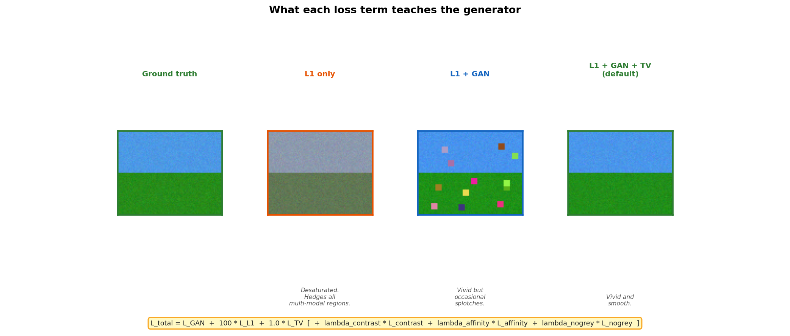

# Chapter 8: Loss Functions - Teaching a Model What "Good" Means

> *"A model will do exactly what you reward it for doing. If you reward mediocrity, you get mediocrity. If you reward fooling a critic, you get colors. If you reward nothing, you get nothing. Possibly literally nothing - check your gradients."*

Loss functions are the most honest part of deep learning. Everything else - architectures, optimizers, fancy tricks - is ultimately in service of one function: a formula that says "this is good" or "this is bad." Get the formula right and the model will find a way. Get it wrong and the model will find a way to cheat it. Both outcomes are educational, but only one of them produces nice-looking photographs.

Our colorization model uses several loss functions at once. Each one teaches the generator something different.

*As in Chapters 5 and 7, this chapter documents the loss terms implemented in `src/losses/` - L1, adversarial, TV, and the optional No-Grey/Contrast/Spatial-Affinity terms. The final thesis model adds a fifth term, SCCL (semantic color consistency via frozen DINOv2), and reweights L1 down to lambda_L1=15; SCCL is implemented inline in the training notebooks, not in `src/losses/`, so it is not covered below. See the top-level README for how it fits in.*

---

## 8.1 The Baseline: L1 Pixel Loss

The most straightforward measure of colorization quality: compare each predicted pixel color to the ground truth and sum up the absolute differences.

```
L_L1 = (1 / N) * sum( |ab_predicted - ab_real| )
```

where N is the total number of pixels times 2 (for the two ab channels).

If the model predicts a = 0.3 and the ground truth is a = 0.5, the contribution from that pixel is 0.2. Repeat over all 256 x 256 = 65,536 pixels and both channels, and you have one number that says "how wrong the color predictions are, on average."

L1 is easy to compute, numerically stable, and produces outputs that are plausible in an average sense. It is also the source of the desaturation problem described in Chapter 6: when many colorizations are valid, the model learns to predict their average, and averages of colors are often gray. The model becomes the world's most consistent underachiever. Never catastrophically wrong, never particularly right. A perpetual C+.

The coefficient in the code is `lambda_L1 = 100`, meaning L1 contributes 100 times more than the raw GAN signal. This keeps the generator from going rogue - the adversarial pressure makes colors vivid, but L1 anchors the predictions to the actual color distribution of the training data.

```
why 100? - if both terms have equal weight, the generator treats
"fool the discriminator" and "match pixel colors" as equally important.
In practice, the GAN signal is noisier and more volatile early in training.
Lambda=100 says: "use GAN for color commitment, but stay tethered to reality."
```

---

## 8.2 The Adversarial Loss: GAN

Chapter 7 described how the GAN setup works. Here is what happens mathematically at the loss level.

The discriminator outputs a 30 x 30 grid of scores, one per 70 x 70 image patch. Each score is a logit - a raw number before any squashing.

**Discriminator loss:**

```
L_D = 0.5 * [L(fake_preds, 0) + L(real_preds, 1)]

where L(scores, target) = BCE(scores, target)  for vanilla GAN
                         = MSE(scores, target)  for LSGAN
```

The discriminator wants real patches to score 1 and fake patches to score 0. The 0.5 factor averages the two terms so neither dominates.

**Generator loss:**

```
L_G_GAN = L(fake_preds, 1)
```

The generator wants the discriminator to assign score 1 to fake images - as if they were real. It passes the fake image through D again (without `.detach()` this time, so gradients flow back), and the loss measures how far the discriminator is from being fooled.

The project uses vanilla GAN (`BCEWithLogitsLoss`) by default, which is `log(D(x))` in the classic formulation. LSGAN (`MSELoss`, from Mao et al. 2017) is also available as a drop-in and tends to produce more stable training - it penalizes confidently-wrong predictions more harshly and does not saturate when the discriminator is very confident.

```python
# from src/losses/gan_loss.py
class GANLoss(nn.Module):
    def __init__(self, gan_mode='vanilla', real_label=1.0, fake_label=0.0):
        super().__init__()
        self.register_buffer('real_label', torch.tensor(real_label))
        self.register_buffer('fake_label', torch.tensor(fake_label))
        if gan_mode == 'vanilla':
            self.loss = nn.BCEWithLogitsLoss()
        elif gan_mode == 'lsgan':
            self.loss = nn.MSELoss()

    def __call__(self, preds, target_is_real):
        labels = self.real_label if target_is_real else self.fake_label
        return self.loss(preds, labels.expand_as(preds))
```

`register_buffer` is a small but important detail. It stores the label tensors on the same device as the model (CPU or GPU) without making them trainable parameters. During training, `real_label.expand_as(preds)` broadcasts the scalar 1.0 (or 0.0) to match the shape of the discriminator output, so the loss can compare them element-wise.

---

## 8.3 Total Variation Loss

Even with L1 and GAN, the generator occasionally produces small, isolated color splotches - pixels with a strange color surrounded by different-colored neighbors. This is especially visible in large uniform areas like sky or wall, where the correct behavior is smooth, consistent color.

Total Variation (TV) loss penalizes abrupt color changes between neighboring pixels:

```
L_TV = sum( (ab[x+1,y] - ab[x,y])^2  +  (ab[x,y+1] - ab[x,y])^2 )
             over all pixels (x,y)
```

Horizontal and vertical differences are computed separately, squared, and summed. The result is high if there are many sharp color transitions, low if the color field is smooth.

```python
# from src/losses/auxiliary.py
def total_variation_loss(img):
    h_tv = torch.pow((img[:,:,1:,:] - img[:,:,:h_x-1,:]), 2).sum()
    w_tv = torch.pow((img[:,:,:,1:] - img[:,:,:,:w_x-1]), 2).sum()
    return 2 * (h_tv / count_h + w_tv / count_w) / batch_size
```

TV loss does not care about the absolute colors, only about transitions. A sky can be any shade of blue, as long as it is consistently that shade of blue. This makes it complementary to L1 (which cares about what the colors are) and GAN (which cares about whether they look realistic). TV loss is the least opinionated member of the loss committee. It has no strong feelings about hue. It just wants everyone to settle down and stop flickering.



---

## 8.4 Auxiliary Losses

The three losses above form the core. The model also offers three optional auxiliary losses that address specific failure modes. They are disabled by default (lambda = 0) and can be enabled in experiments.

### No-Grey Loss

The desaturation problem discussed in Chapter 6 does not disappear entirely with GAN training. In ambiguous regions - patches of wall, road, or shadow where the true color is genuinely uncertain - the generator may still hedge toward neutral gray.

`NoGreyLoss` attacks this directly - because sometimes you need a loss function whose sole purpose is to tell the model to stop being such a coward about color:

```python
# from src/losses/no_grey.py
def forward(self, ab_pred):
    saturation = torch.norm(ab_pred, dim=1, keepdim=True)  # [B, 1, H, W]
    loss = torch.clamp(self.threshold - saturation, min=0.0)
    return loss.mean()
```

`saturation` is the distance from the origin in ab space: `sqrt(a^2 + b^2)`. If that distance is below the threshold (0.05 by default, in normalized units where the full ab range is [-1, 1]), the pixel contributes a positive loss proportional to how unsaturated it is. Fully colored pixels contribute zero.

This is a **soft lower bound on saturation**: it does not force every pixel to be vivid, but it penalizes the generator for retreating too close to gray. The clamp ensures that only unsaturated pixels pay - already-colored pixels are not penalized for being colorful.

### Contrast Loss

Some scenes have extreme lighting conditions: dark interiors, bright snowfields, high-contrast portraits. A model trained mainly on average outdoor scenes may systematically underestimate contrast in these cases.

`ContrastLoss` measures contrast as the standard deviation of the L channel (which is fixed - the model does not predict L) and penalizes the generator when its output differs in contrast from the target:

```python
# from src/losses/auxiliary.py
def contrast_loss(fake_img, real_img):
    fake_std = torch.std(fake_L.view(fake_L.size(0), -1), dim=1)
    real_std = torch.std(real_L.view(real_L.size(0), -1), dim=1)
    return torch.abs(fake_std - real_std).mean()
```

In practice this loss matters most when the training set is imbalanced (many gray overcast photos, few high-contrast scenes). On a diverse dataset like COCO it is less critical.

### Spatial Color Affinity Loss

The most original of the auxiliary losses. The core intuition: if two neighboring pixels have nearly identical luminance (L), they are likely part of the same object or surface, and a realistic colorization should give them similar colors.

```python
# from src/losses/spatial_affinity.py
# For horizontal neighbors:
L_diff_h  = |L[:,:,:,:-1] - L[:,:,:,1:]|        # luminance difference
similar_h = (L_diff_h < threshold).float()        # 1 where similar

ab_diff_pred_h   = |ab_pred[:,:,:,:-1] - ab_pred[:,:,:,1:]|
ab_diff_target_h = |ab_target[:,:,:,:-1] - ab_target[:,:,:,1:]|

loss_h = (similar_h * |ab_diff_pred_h - ab_diff_target_h|).mean()
```

For every pair of horizontal (or vertical) neighbors where the luminance difference is below the threshold (0.1 in normalized units): the color transition in the prediction should match the color transition in the ground truth.

Note that this loss does not say "similar luminance must mean identical color" - it says "the color smoothness pattern should match the ground truth pattern." Two adjacent sky pixels with similar L should have similarly smooth ab; two adjacent pixels at a sharp luminance edge (like a fence post against a bright sky) do not need to match each other's color at all.


---

## 8.5 The Combined Generator Loss

In the training loop, all active losses are summed:

```python
# from src/training/model.py
self.loss_G = (
    self.loss_G_GAN
    + self.loss_G_L1          # * lambda_L1 (100)
    + self.loss_G_TV          # * lambda_TV (1.0)
    + self.loss_G_contrast    # * lambda_contrast (0 by default)
    + self.loss_G_affinity    # * lambda_affinity (0 by default)
    + self.loss_G_nogrey      # * lambda_nogrey (0 by default)
)
self.loss_G.backward()
```

Each lambda is a dial that adjusts the relative importance of each objective. The default configuration (L1 + GAN + TV) is conservative - it works reliably across a wide range of images. The auxiliary losses are labeled `lambda=0` not because they are useless, but because they interact with each other and tuning them requires care.

```
A useful mental model for the combined loss:

  L1       ->  "predict the right colors"
  GAN      ->  "make the colors look real, not averaged"
  TV       ->  "keep colors smooth, no splotches"
  NoGrey   ->  "do not hide in gray when uncertain"
  Contrast ->  "match the luminance dynamics of real photos"
  Affinity ->  "color-smooth where luminance is smooth"
```

These are not conflicting demands. They are complementary perspectives on the same question: what does a good colorization look like?

---

## 8.6 Why Not Just Use One?

Each loss alone fails in a predictable way.

```
L1 alone:
  Pros: stable, produces correct average colors
  Fails: desaturation, muddy hues in ambiguous regions

GAN alone:
  Pros: vivid, committed colors
  Fails: unstable training, colors can drift far from truth (sky becomes green, etc.)

TV alone:
  Pros: smooth outputs
  Fails: it would minimize TV by making everything one flat color
         (zero transitions = zero TV loss. technically optimal. terrible photo.)

L1 + GAN (the standard pix2pix recipe):
  Pros: correct and vivid
  Fails: occasionally still grayish; may produce splotches in uniform areas

L1 + GAN + TV (our default):
  Pros: correct, vivid, smooth
  Still fails: ambiguous regions, contrast extremes (hence the auxiliary options)
```

The iterative process of diagnosing failure modes and adding targeted loss terms is not unique to this project. It is the standard engineering workflow in generative modeling. You train, you look at the outputs, you identify the specific way in which they still look wrong, and you write a loss that penalizes exactly that. Then you train again. The process ends when you either run out of failure modes or run out of GPU budget. Usually both happen around the same time.

---

[Next chapter: Uncertainty - When the Model Knows It Does Not Know](chapter_09_uncertainty.md)
