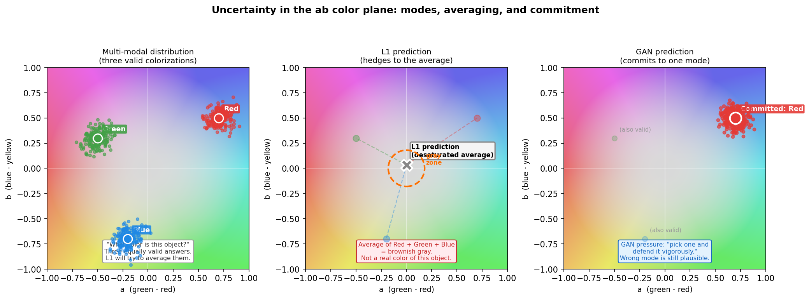
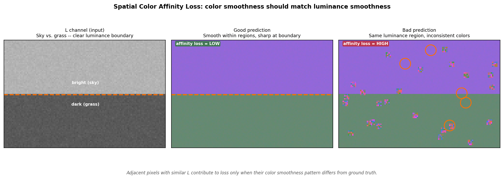

# Chapter 9: Uncertainty - When the Model Knows It Does Not Know

> *"The model is not confused. It is simply aware that the car in the parking lot could be red, or blue, or silver, or the sort of off-white that only exists in rental fleets. It has processed thousands of parking lots. It has learned humility."*

Every colorization involves a decision under uncertainty. Some decisions are easy: grass is green, sky is blue, blood oranges are - well, you get the idea. But most of the world is not so obliging. Cars come in all colors. Shadows are whatever-gray. Old brick can be orange, brown, or the ambiguous rust of a city that stopped caring.

The way a model handles this uncertainty determines the visual quality of its outputs more than any other single factor. This chapter examines where the uncertainty comes from and what the different loss terms from Chapter 8 do to manage it.

---

## 9.1 Where Uncertainty Comes From

The input to the model is an L channel: a 256 x 256 array of lightness values. The output should be an ab channel: a 256 x 256 x 2 array of colors.

The problem is that the mapping from L to ab is not a function. There is no rule that takes a specific grayscale pixel value and produces a unique correct color. The same pixel value 140/255 can correspond to:

```
- light blue sky
- pale green wall
- sandy road
- white clothing in shadow
- silver car door
- any of several hundred other surfaces
```

Context helps narrow it down. A pixel at the top of the image surrounded by other bright pixels is probably sky. A pixel in a horizontal band near the bottom is probably ground. But context never eliminates uncertainty entirely, especially in complex scenes.

This means the model is not trying to compute a function. It is trying to sample from a **conditional probability distribution**: given this grayscale image, what is the distribution of plausible colorizations?

```
For an image of a parrot in a jungle:

  P(ab | L) is a distribution with several modes:
    Mode A: red parrot, green jungle   (probability 0.4)
    Mode B: green parrot, green jungle (probability 0.35)
    Mode C: blue parrot, green jungle  (probability 0.25)

  The L1-optimal prediction:
    0.4 * red + 0.35 * green + 0.25 * blue = brownish gray
    (This is the expected value of the distribution, not a sample from it.)
```

The model trained with L1 loss is finding the expected value. The expected value of a multimodal distribution is often in a low-probability region - or outside the support of the distribution entirely, as when averaging red and green produces brown, which is not a common parrot color.

---

## 9.2 How L1 Loss Handles Uncertainty: Averaging

L1 is minimized by the **median** of the conditional distribution. (L2/MSE is minimized by the mean; L1 by the median. For unimodal symmetric distributions they are the same. For multimodal distributions, neither is great.)

In practice, the effect is desaturation. When the model is uncertain about hue, it predicts a color with low saturation - close to the center of the ab space, where all hues blend into gray. This minimizes the average L1 distance to all plausible colorizations because gray is "sort of close" to every color rather than "exactly right" for any one.

```
Three equally plausible hues in normalized ab space:
  Red:   (a=0.7, b=0.5)
  Green: (a=-0.5, b=0.3)
  Blue:  (a=-0.2, b=-0.7)

Median prediction (roughly):
  a ≈ -0.2,  b ≈ 0.3    (a muddy pinkish-gray)

L1 distance to each true color:
  |(-0.2 - 0.7)| + |(0.3 - 0.5)| = 0.9 + 0.2 = 1.1
  |(-0.2 - -0.5)| + |(0.3 - 0.3)| = 0.3 + 0.0 = 0.3
  |(-0.2 - -0.2)| + |(0.3 - -0.7)| = 0.0 + 1.0 = 1.0

Average L1: (1.1 + 0.3 + 1.0) / 3 = 0.8

Compare to predicting Red (a=0.7, b=0.5):
  L1 to Red: 0.0,  to Green: 1.2,  to Blue: 1.9
  Average: 1.03  - worse than the gray hedge
```

The gray hedge wins numerically. The model is not broken. It is doing exactly what you asked.

This is one of the more quietly devastating moments in applied machine learning. You specified the loss function. The model optimized it. The model is right. You asked for the wrong thing. The model had no way of knowing. It just did math.

---

## 9.3 How GAN Loss Handles Uncertainty: Committing

The discriminator changes the game. It does not measure the average distance to all plausible colors - it classifies whether the full image (L plus predicted ab) looks like a real photograph or not.

A desaturated, gray-hedged prediction does not look like a real photograph. Real photographs have vivid, committed colors. The discriminator, having been trained on real colorized images, learns to penalize grayish predictions even when they are "close" to the ground truth in L1 terms.

This pushes the generator to stop hedging. Instead of predicting the safe average, it must commit to one plausible colorization and make it look convincing. Whether it commits to Mode A (red parrot) or Mode B (green parrot) does not matter to the discriminator - both are plausible. What matters is that it commits to one and executes it with conviction.

```
Generator strategy under GAN pressure:

  Old (L1 only):
    "Red and green are both plausible. I'll predict brownish gray to be safe."

  New (L1 + GAN):
    "Red and green are both plausible. The discriminator will penalize
     brownish gray. I'll pick one and commit. Red. Final answer."
```

The tradeoff: the generator may pick the "wrong" mode. If the ground truth was a green parrot and the generator committed to red, the L1 loss is high. But the image looks like a real photograph of a red parrot, which is visually plausible and only technically wrong.

---

## 9.4 NoGreyLoss: A Targeted Nudge

Even with GAN loss, some ambiguous regions drift toward gray. Shadow areas, paved roads, concrete walls - the discriminator has seen enough real gray things that a gray prediction passes its test.

`NoGreyLoss` adds a direct saturation constraint:

```python
saturation = torch.norm(ab_pred, dim=1, keepdim=True)  # sqrt(a^2 + b^2)
loss = torch.clamp(threshold - saturation, min=0.0).mean()
```

Any pixel whose ab vector has magnitude below `threshold` (default 0.05 in normalized units, corresponding to roughly 5.5 in raw ab units) contributes a positive loss. This is a soft floor: it does not force the model to invent color where there is genuinely none. It nudges it away from the gray-center hedge.



```
effect of NoGreyLoss on the ab plane:

  Without: predictions cluster near (a=0, b=0) for uncertain regions
  With:    predictions pushed outward, away from the center
           by at least the threshold distance
```

The threshold is tunable. Set it too high and the model will force color into surfaces that are genuinely gray (concrete, metal, ash) - producing visually wrong results. Set it at 0, and it does nothing. The default (0.05) is a gentle push, not a command. The model can still decide that concrete is gray. It is allowed to be correct. It just has to earn it.

---

## 9.5 Spatial Affinity: Exploiting Local Context

Uncertainty is not uniform across the image. The same pixel value can be ambiguous in isolation but very constrained given its neighbors.

If pixels at (100, 100), (100, 101), and (100, 102) all have lightness 0.65 with no sharp transitions between them, they are almost certainly part of the same surface. Real surfaces have smooth, consistent color. A realistic colorization should respect this: if the model commits to blue for (100, 100), it should commit to similar blue for the neighbors.

`SpatialColorAffinityLoss` encodes this:

```
For each pair of horizontally adjacent pixels (i, j):
  if |L_i - L_j| < threshold:       <- similar luminance, likely same surface
    penalize |color_smoothness_pred - color_smoothness_real|
```

It does not say "same luminance = same color" - that would be wrong for color images where hue transitions can occur independently of lightness. It says "the pattern of color smoothness in the prediction should match the pattern in the ground truth." Where the ground truth has a smooth color field (sky, grass, walls), the prediction should too.



This is one of the custom contributions of this project. The intuition comes from the observation that most visible GAN colorization artifacts are spatially incoherent: isolated pixels or small patches with a different color from their surroundings, in regions where no such transition exists in the real image.

---

## 9.6 What Uncertainty Cannot Be Fixed

Some uncertainty is irreducible. Given a grayscale image of a crowd scene, there is no way to know what color each person's clothing is. Given a photo of a generic building, the correct wall color is unknown. Given a close-up of sand, any color in the sandy range is valid.

The model will produce one specific colorization, and it will look plausible. Whether it matches the "true" colorization (the original color photo) is a question the L1 loss can answer but the human eye often cannot. A red car colorized as blue does not look wrong - it looks like a blue car.

This is not a flaw in the model. It is the correct behavior for a system that is trying to produce visually plausible outputs in the absence of ground truth. The goal is not "reproduce the original photograph exactly" - that is impossible from a grayscale input. The goal is "produce a colorization that a human would accept as real," and that goal is achievable.

```
Evaluation metrics reflect this reality:

  PSNR / SSIM: measure pixel-level accuracy against a single ground truth
    -> penalize correct-but-different colorizations (blue car instead of red)
    -> not ideal for multi-modal outputs

  FID (Frechet Inception Distance): measures the distribution of generated images
     against the distribution of real images
    -> a blue car gets no penalty if blue cars are plausible
    -> better aligned with "does it look real?"

  Human evaluation: most direct, least scalable
```

There is always one annotator who marks every image as obviously fake. There is always one who marks every image as perfectly realistic. They cancel each other out. The solution is more annotators. The problem is that humans are expensive and easily bored, which is why we built this model in the first place.

---

## 9.7 Making the Model Say So: A Learned Uncertainty Head

Everything above is about uncertainty as a *phenomenon* - something that shapes what the generator learns to predict, indirectly, through the loss. This project also has a direct version: a small head that predicts, per pixel, *how* uncertain the model currently is, as a number you can read out and visualize.

`UncertaintyGenerator` (`src/models/generator.py`) wraps a trained colorization generator and adds a 1x1 convolution on top of its color prediction:

```python
class UncertaintyGenerator(nn.Module):
    def __init__(self, base_generator):
        super().__init__()
        self.base = base_generator
        self.logvar_head = nn.Conv2d(2, 2, kernel_size=1)
        nn.init.zeros_(self.logvar_head.weight)
        nn.init.constant_(self.logvar_head.bias, -2.0)   # start confident

    def forward(self, L):
        ab_mean = self.base(L)
        log_var = self.logvar_head(ab_mean)
        return ab_mean, log_var
```

It is trained with `GaussianNLLLoss` (`src/losses/uncertainty.py`) instead of plain L1:

```python
loss = 0.5 * (log_var + (ab_target - ab_mean) ** 2 * torch.exp(-log_var))
```

The `exp(-log_var)` term is the mechanism worth noticing: a large prediction error costs less when `log_var` is high, and the `log_var` term itself is a penalty for claiming high uncertainty everywhere. The two pull against each other - the model can only "afford" to be uncertain where the error would otherwise be large, which is exactly the ambiguous-region behavior this chapter has been describing conceptually. Converting `log_var` back to a per-pixel standard deviation (`exp(0.5 * log_var)`) gives a heatmap: bright where the model is guessing, dark where it is confident. This is what the "Uncertainty" tab in the web demo (`web/`) visualizes.

---

[Next chapter: Training - The GPU Marathon](chapter_10_training.md)
