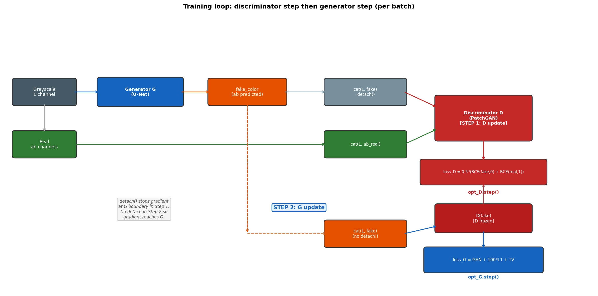

# Chapter 10: Training - The GPU Marathon

> *"Training a GAN is like teaching two people to improve by competing with each other. Sounds elegant in theory. In practice, one of them always gets demoralized around epoch 5 and stops trying. Your job is to stop that from happening."*

All the architecture decisions, all the loss functions, all the careful color space choices - none of it matters until a training loop runs for several hours and produces a model that can actually colorize images. This chapter walks through how that training loop works, what can go wrong, and why certain choices were made.

---

## 10.1 The Dataset

*This chapter documents the baseline GAN pipeline in `src/` - L1 + adversarial + TV loss, the setup this book builds up to. The best-performing model reported in the thesis adds a colorfulness curriculum, a semantic consistency loss (SCCL, built on frozen DINOv2 features), and a second DINOv2 cross-attention refinement stage on top of this baseline, trained on a larger 15,000-image split. That pipeline lives in the training notebooks (`notebooks/04_main_models/`) rather than in `src/`; see the top-level README and the thesis for its exact numbers. The concepts here - the dataset, the optimizer, the training loop, the failure modes - still apply to it directly.*

The model is trained on 13,000 images from the COCO dataset (Common Objects in Context). COCO was originally designed for object detection and segmentation, which is why it contains a wide variety of scene types: outdoor scenes, indoor scenes, people, animals, vehicles, food. This variety is useful for colorization - a model trained only on landscapes would be terrible at colorizing portraits.

Images are resized to 256 x 256 before being fed to the model. This is a hard requirement: the U-Net architecture has fixed-size skip connections, and feeding images of a different size would cause dimension mismatches.

```python
# from src/data/dataset.py
class ColorizationDataset(Dataset):
    def __getitem__(self, idx):
        img = Image.open(self.paths[idx]).convert("RGB")
        img = self.transforms(img)       # resize, optional flip
        img = np.array(img)
        img_lab = rgb2lab(img).astype("float32")
        img_lab = transforms.ToTensor()(img_lab)

        L  = img_lab[[0], ...] / 50. - 1.   # -> [-1, 1]
        ab = img_lab[[1, 2], ...] / 110.     # -> [-1, 1] approx

        return {'L': L, 'ab': ab}
```

Each image is loaded as RGB, converted to LAB, and split into L and ab channels. The normalization divides by 50 (for L) or 110 (for ab), centering both in roughly [-1, 1]. The model therefore never sees raw pixel values -- only normalized floats.

During training, one augmentation is applied: random horizontal flip. This doubles the effective dataset size at zero cost, since a horizontally flipped photograph of a park is still a valid photograph of a park. Vertical flip is not used -- an upside-down sky would train the model on nonsense.

```
Dataset split:
  Training:   ~12,000 images
  Validation: ~1,000 images

Validation has no augmentation (no flipping) -- clean, repeatable evaluation.
```

---

## 10.2 Weight Initialization

Before training starts, the discriminator and the new parts of the generator (the decoder, the upsampling blocks) need initial weights. The pretrained ResNet-18 encoder keeps its ImageNet weights.

```python
# from src/training/utils.py
def init_weights(net, init='norm', gain=0.02):
    def init_func(m):
        classname = m.__class__.__name__
        if hasattr(m, 'weight') and 'Conv' in classname:
            nn.init.normal_(m.weight.data, mean=0.0, std=gain)
            nn.init.constant_(m.bias.data, 0.0)
        elif 'BatchNorm2d' in classname:
            nn.init.normal_(m.weight.data, 1., gain)
            nn.init.constant_(m.bias.data, 0.)
    net.apply(init_func)
```

Conv layers get small random weights drawn from N(0, 0.02). BatchNorm scale parameters start at 1 with small noise (so they start close to identity -- not rescaling anything). Bias terms start at 0.

This initialization comes from the original pix2pix paper (Isola et al. 2017). The std=0.02 is chosen so that initial activations are in a reasonable range -- not so large that they saturate activation functions, not so small that gradients vanish before anything is learned.

Do not apply this initialization to the pretrained encoder. `init_model` is called on the discriminator and on the full model, but the encoder weights are loaded separately and should remain intact.

---

## 10.3 Optimizers

Both networks use **Adam** with the same learning rate:

```python
self.opt_G = optim.Adam(net_G.parameters(), lr=2e-4, betas=(0.5, 0.999))
self.opt_D = optim.Adam(net_D.parameters(), lr=2e-4, betas=(0.5, 0.999))
```

Adam is chosen over SGD because GAN training is notoriously sensitive to learning rate. Adam's adaptive per-parameter learning rates make it more forgiving. The default Adam betas are (0.9, 0.999), but GAN literature consistently recommends beta1=0.5. The reason: beta1=0.9 gives high momentum, which helps optimization in stable settings but can cause the generator or discriminator to overshoot and destabilize in the adversarial setting. Beta1=0.5 is more cautious.

The learning rate 2e-4 is the value from the pix2pix paper and has proven reliable across many conditional image generation tasks. It is a reasonable starting point, not a carefully tuned value.

---

## 10.4 The Training Loop

Each training step processes one batch (16 images by default). The step has two parts: update the discriminator, then update the generator.

```python
# from src/training/model.py
def optimize(self):
    self.forward()               # generate fake colors

    # --- Discriminator step ---
    self.net_D.train()
    self.set_requires_grad(self.net_D, True)
    self.opt_D.zero_grad()
    self.backward_D()            # compute D loss, backprop
    self.opt_D.step()            # update D weights

    # --- Generator step ---
    self.net_G.train()
    self.set_requires_grad(self.net_D, False)   # freeze D during G update
    self.opt_G.zero_grad()
    self.backward_G()            # compute G loss, backprop
    self.opt_G.step()            # update G weights
```

The two-step structure is mandatory. If you updated both simultaneously, the discriminator gradients from step 1 would be mixed with the generator gradients from step 2, and neither would be correct.

**Why `set_requires_grad(net_D, False)` before updating G?**

During the generator update, the fake image passes through the discriminator (to compute `L_G_GAN`). PyTorch will compute gradients through the discriminator and back into the generator. But the discriminator weights should not change during this pass -- only the generator is being updated. Setting `requires_grad=False` on all D parameters prevents PyTorch from computing gradients for them, which also saves memory and computation.

```
Training step in detail:

1. forward():
   fake_color = G(L)

2. backward_D():
   fake_image = cat(L, fake_color.detach())  <- detach: stop gradients at G
   fake_preds = D(fake_image)
   loss_D_fake = criterion(fake_preds, 0)
   real_image = cat(L, ab_real)
   real_preds = D(real_image)
   loss_D_real = criterion(real_preds, 1)
   loss_D = 0.5 * (loss_D_fake + loss_D_real)
   loss_D.backward()
   opt_D.step()

3. backward_G():
   fake_image = cat(L, fake_color)  <- no detach: gradients flow through D -> G
   fake_preds = D(fake_image)
   loss_G_GAN = criterion(fake_preds, 1)      <- G wants D to say "real"
   loss_G_L1  = L1(fake_color, ab_real) * 100
   loss_G_TV  = TV(fake_image)
   loss_G = loss_G_GAN + loss_G_L1 + loss_G_TV
   loss_G.backward()
   opt_G.step()
```

**The `.detach()` in backward_D** is critical. When computing the discriminator loss on fake images, we do not want gradients to flow back into the generator. At this point we are only updating D. `.detach()` cuts the computational graph at the `fake_color` tensor, so no gradient reaches G.

In `backward_G`, there is no detach. Gradients flow from `loss_G` back through D (whose weights are frozen) and then into G, updating the generator to produce images that fool the discriminator.



---

## 10.5 Loss Tracking

Debugging GAN training without loss curves is like driving with no speedometer. The model might be fine or it might be in catastrophic mode collapse -- the loss numbers tell you which.

```python
# from src/training/utils.py
class AverageMeter:
    def update(self, val, count=1):
        self.count += count
        self.sum   += count * val
        self.avg    = self.sum / self.count
```

`AverageMeter` tracks the running average of each loss over one epoch. At the end of each epoch, `log_results` prints the averages:

```
loss_D_fake:    0.48231
loss_D_real:    0.39817
loss_D:         0.44024
loss_G_GAN:     0.71543
loss_G_L1:      9.23411
loss_G_TV:      0.00342
loss_G:        10.94296
```

What healthy numbers look like:

```
loss_D       ~ 0.4 - 0.7  (D is right more often than chance, not perfect)
loss_G_GAN   ~ 0.5 - 1.5  (G sometimes fools D, sometimes not)
loss_G_L1    ~ 5 - 15      (pixel error in normalized units * 100)
```

What unhealthy numbers look like:

```
loss_D -> 0:
  D is perfect. G produces obvious fakes. G cannot learn because
  the D gradient is near-zero (D is saturated). Training has collapsed.

loss_D -> 0.69 (ln(2)):
  D is random. It has given up or the problem is too hard.
  G gets no useful signal. Training has also collapsed, differently.

loss_G_L1 -> 0 but images look gray:
  G has learned to predict the L channel (gray) for ab, which is
  technically close to zero but produces desaturated output.
  Check normalization.
```

---

## 10.6 What a Healthy Training Run Looks Like

A well-behaved run typically goes through recognizable phases.

**Epochs 1-5: calibration**

The discriminator is initialized randomly. The generator is initialized randomly except for the encoder. In the first epoch, D quickly learns to distinguish fake (random gray) from real. G starts getting a useful signal and begins producing rough color patches. The loss_D value drops from ~0.69 (random) to ~0.5. Loss_G rises as D gets better.

**Epochs 5-20: competition**

The generator and discriminator trade blows. G learns to produce colors that partially fool D; D learns to catch those specific patterns; G adapts. The L1 loss decreases steadily. The GAN loss oscillates -- this is normal. Monotonic decrease of loss_G_GAN would mean D has stopped learning.

**Epochs 20+: refinement**

Major color regions are correct. The remaining errors are in fine details: edge sharpness, specific hue choices in ambiguous regions, isolated artifacts. The L1 loss plateaus. GAN loss stabilizes. Visually, images look plausible but may still have occasional strange colors.

```
Rough timings on a T4 GPU (Google Colab):
  1 epoch (12,000 images, batch_size=16):  ~25-35 minutes
  20 epochs:                               ~8-12 hours
  Full useful training:                    ~15-20 epochs
```

---

## 10.7 What Can Go Wrong

GANs have a larger surface area for failure than standard supervised models. The most common failure modes:

**Mode collapse**: the generator finds one or two colorizations that fool the discriminator and repeats them for all inputs. Sky is always the same shade of blue, grass is always the same green. The L1 loss stays high (the specific colors are wrong), the GAN loss stays low (D cannot catch it). Fix: check batch diversity, consider different GAN formulation.

**Discriminator dominance**: D becomes too powerful too quickly. G cannot produce anything realistic and stops getting useful gradients. Loss_D -> 0. Fix: reduce D learning rate, add noise to D inputs, reduce D complexity.

**Generator dominance**: G finds a way to fool D without producing realistic images -- for example by saturating the discriminator's output. Loss_G_GAN -> 0 but images look wrong. Fix: increase D learning rate, retrain D more steps per G step.

**Checkerboard artifacts**: high-frequency grid-like patterns in the output. Usually caused by transposed convolutions, or by plain PixelShuffle upsampling started from a random init. This project's decoder uses PixelShuffle with ICNR initialization (Chapter 5, section 5.3) specifically to avoid this failure mode from the first training step onward. If checkerboarding appears anyway, check that ICNR init is actually being applied to the upsampling blocks.

**Training instability** (loss spikes): usually caused by learning rates that are too high, or by a batch containing a very unusual image. Gradient clipping can help; reducing lr_G and lr_D is usually sufficient.

---

## 10.8 Running on Colab

The notebooks in this repository are designed to run on Google Colab with a T4 GPU (free tier). Practical notes:

```python
# DataLoader settings for Colab
dataloader = DataLoader(
    dataset,
    batch_size=16,          # 16 fits comfortably in 16GB T4 VRAM
    num_workers=2,          # 2 workers is reliable on Colab; set to 0 if crashes
    pin_memory=True,        # only helps on GPU, dataset.py handles this automatically
    persistent_workers=True # keep workers alive between batches -- faster
)
```

If the DataLoader raises "DataLoader worker exited unexpectedly": set `n_workers=0`. Colab's forked process environment occasionally conflicts with multiprocessing.

If training runs out of memory: reduce `batch_size` to 8. The model still trains; convergence is slightly slower and noisier.

The training loop saves checkpoint files periodically. If Colab disconnects mid-run (it will), the latest checkpoint allows resuming without starting from scratch.

---

## 10.9 The Full Picture

Thirteen chapters ago (from the model's perspective, although the book is only ten) the starting point was a pile of COCO photographs, a pretrained ResNet-18, and a blank discriminator. The final trained model:

- reads a single-channel grayscale image
- runs it through an encoder that extracts semantic information at multiple scales (Chapter 5)
- compresses everything into an 8 x 8 x 512 bottleneck
- decodes back to full resolution using skip connections that reintroduce spatial detail
- outputs two channels in LAB color space (Chapter 6)
- was trained against a discriminator that judged 900 local patches per image (Chapter 7)
- with a combined loss that penalized pixel error, perceptual unrealism, color noise, and gray hedging (Chapter 8)
- producing outputs that are visually plausible even when the correct answer was ambiguous (Chapter 9)

None of this is magic. Every step has a reason, and the reasons trace back to specific mathematical limitations of simpler approaches. The reason LAB is used instead of RGB: luminance and color are entangled in RGB. The reason skip connections exist: downsampling destroys spatial precision. The reason GAN loss exists: L1 alone produces averages of modes. The reason lambda_L1=100: the GAN signal is noisier.

Understanding the "why" of each component is more useful than memorizing the architecture. Architectures change. The problems they solve do not.

---

*End of book.*
